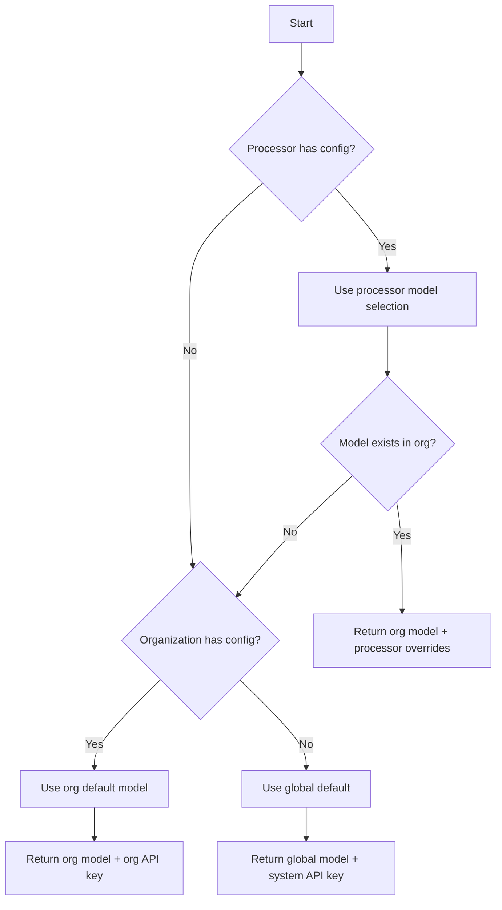

# LLM Provider Configuration Architecture

> **Last Updated:** 2025-11-09

## Overview

ValidAI implements a flexible 3-tier configuration hierarchy for managing Large Language Model (LLM) providers and their settings. This architecture allows for progressive customization from system-wide defaults down to processor-specific optimizations.

> **Note on Phase 1.9 Direct Upload:** The document upload method (Storage vs direct upload to Edge Function) is independent of LLM provider configuration. Phase 1.9 added the ability to bypass Supabase Storage for faster uploads (3-7s improvement), but this does not affect how documents are processed by LLM providers. See [Manual Processor Execution Architecture](./manual-processor-execution.md#h-phase-19-direct-upload-optional-storage) for details on direct upload.

## Implementation Status

**Current Implementation (as of 2025-11-09):**

### ✅ Fully Implemented
- **Database Schema:** All tables, columns, and functions are in place and working
  - `validai_llm_global_settings` table with seeded Anthropic, Mistral, and Google (Gemini) models
  - `organizations.llm_configuration` JSONB column
  - `validai_processors.configuration` JSONB column
- **Database Functions:** All resolution and configuration functions operational
  - `get_llm_config_for_run()` - Resolves configuration through 3-tier hierarchy
  - `set_organization_llm_config()` - Saves organization settings with encryption
  - `get_available_llm_models()` - Returns available models
- **TypeScript Types:** Complete type definitions in `lib/types/llm-config.types.ts`
- **React Hooks:** All hooks implemented in `hooks/use-llm-config.ts`
- **Edge Functions:** Production run execution fully integrated with LLM config resolution
- **Security:** API key encryption and global fallback working

### ⚠️ Architecturally Ready, UI Pending
- **Processor Model Selection:** Database supports `selected_model_id` in `validai_processors.configuration`, but no UI to set it yet
- **Processor Settings Override:** Database supports `settings_override` for temperature/max_tokens, but no UI exists
- **Organization LLM Management:** Hooks are ready, but Pro/Enterprise admin UI not built

### 🔄 Current Behavior
- **All processors use global default model** (Claude Haiku 4.5) via automatic fallback
- **Organizations cannot configure custom API keys yet** (all use global `ANTHROPIC_API_KEY`, `MISTRAL_API_KEY`, and `GOOGLE_API_KEY` from Edge Function environment)
- **Processor configuration only stores** `default_run_view` field (for UI preference, not LLM settings)
- **System prompt is the only processor-level LLM customization** available through UI

### 📋 Roadmap
This document describes the **complete architecture** as designed. Implementation priority:
1. ✅ **Phase 1 (Complete):** Core database schema and resolution logic
2. ⏳ **Phase 2 (Pending):** Processor model selection UI
3. ⏳ **Phase 3 (Pending):** Organization LLM configuration UI (Pro/Enterprise feature)
4. ⏳ **Phase 4 (Future):** Advanced settings overrides and usage analytics

## Configuration Hierarchy

The system follows a strict 3-level hierarchy where each level can override the settings from the level above:

```
┌─────────────────────┐
│   Global Settings   │ ← System defaults (all users)
└──────────┬──────────┘
           │
           ▼
┌─────────────────────┐
│ Organization Config │ ← Custom API keys & models (Pro/Enterprise)
└──────────┬──────────┘
           │
           ▼
┌─────────────────────┐
│  Processor Config   │ ← Task-specific overrides
└─────────────────────┘
```

### 1. Global Level (System Defaults)

**Table**: `validai_llm_global_settings`

The global level provides system-wide defaults that are available to all users. These are managed by system administrators and serve as the fallback when no custom configuration exists.

**Key Features**:
- Multiple models can be registered
- One model marked as `is_default`
- System provides API keys (users don't need their own)
- Base configuration settings (temperature, max_tokens, etc.)

**Example Global Settings**:
```json
{
  "provider": "anthropic",
  "model_name": "claude-3-5-sonnet-20241022",
  "display_name": "Claude 3.5 Sonnet",
  "is_default": true,
  "configuration": {
    "default_temperature": 1.0,
    "default_max_tokens": 4096,
    "default_top_p": 1.0,
    "context_window": 200000,
    "supports_top_p": true
  }
}
```

**Model Capabilities**:

Models may have restrictions on which API parameters they support. The `supports_top_p` flag indicates whether a model can accept both `temperature` and `top_p` parameters simultaneously:

- **Claude 4.5 models** (Haiku 4.5, Sonnet 4.5): `supports_top_p: false`
  - These models only accept `temperature` parameter
  - Attempting to send both parameters results in API error
- **Claude 3.x models** (3.5 Sonnet, 3.5 Haiku, 3 Opus): `supports_top_p: true`
  - These models accept both `temperature` and `top_p` parameters
  - Both can be used for sampling control

The LLM executor automatically handles this by conditionally including `top_p` based on model capabilities.

### 2. Organization Level (Custom Configuration)

**Column**: `organizations.llm_configuration`

Organizations with Pro or Enterprise accounts can configure their own LLM settings, including:
- Custom API keys (encrypted)
- Available models for their users
- Organization-wide default model
- Override global settings

**Data Structure**:
```json
{
  "api_keys_encrypted": {
    "anthropic": "encrypted_key_here",
    "mistral": "encrypted_key_here",
    "google": "encrypted_google_key_here"
  },
  "available_models": [
    {
      "id": "sonnet",
      "provider": "anthropic",
      "model": "claude-3-5-sonnet-20241022",
      "display_name": "Fast & Smart"
    },
    {
      "id": "opus",
      "provider": "anthropic",
      "model": "claude-3-opus-20240229",
      "display_name": "Most Capable"
    },
    {
      "id": "mistral",
      "provider": "mistral",
      "model": "mistral-large-latest",
      "display_name": "Cost Effective"
    }
  ],
  "default_model_id": "sonnet"
}
```

### 3. Processor Level (Fine-tuned Control)

**Column**: `validai_processors.configuration`

Individual processors can select specific models and override settings for their particular use case.

**Data Structure (Designed)**:
```json
{
  "selected_model_id": "opus",
  "settings_override": {
    "temperature": 0.2,
    "max_tokens": 8192
  },
  "default_run_view": "technical"
}
```

**Current Implementation Note:**
- ⚠️ `selected_model_id` and `settings_override` are **supported by the database and resolution logic** but have **no UI yet**
- ✅ `default_run_view` is the only field currently settable via UI (determines which view to show on run detail page)
- In practice, processors currently use organization or global defaults for LLM configuration
- System prompt (stored in `validai_processors.system_prompt` column, not in `configuration`) is the primary processor-level customization available

## Resolution Logic

The system resolves configuration using the `get_llm_config_for_run()` function, which follows this logic:



### Resolution Example

Given:
- **Global**: Claude Sonnet as default
- **Organization**: Has Anthropic + Mistral keys, Sonnet as default
- **Processor**: Selects Opus with temperature 0.2

Result:
```json
{
  "provider": "anthropic",
  "model": "claude-3-opus-20240229",
  "display_name": "Most Capable",
  "api_key_encrypted": "org_encrypted_key",
  "organization_id": "org_uuid",
  "settings": {
    "temperature": 0.2,  // Processor override
    "max_tokens": 8192   // From processor
  }
}
```

## Database Implementation

### Core Tables and Functions

#### Tables
- `validai_llm_global_settings` - Stores all available models and their default configurations
- `organizations.llm_configuration` - JSONB column for organization-specific settings
- `validai_processors.configuration` - JSONB column for processor-specific settings

#### Key Functions

1. **`get_llm_config_for_run(processor_id)`**
   - Main resolution function
   - Returns fully resolved configuration
   - Handles the 3-tier hierarchy

2. **`set_organization_llm_config(api_keys, models, default_model_id)`**
   - Updates organization configuration
   - Encrypts API keys automatically
   - Validates model structure

3. **`get_available_llm_models()`**
   - Returns models available to current user
   - Shows organization models if configured
   - Falls back to global models

4. **`encrypt_api_key(plaintext, org_id)` / `decrypt_api_key(ciphertext, org_id)`**
   - Handles secure API key storage
   - Organization-specific encryption
   - Decrypt restricted to service role

## Security Architecture

### API Key Storage

**Current Implementation (Pre-Production):**
- Global API keys stored in Edge Function environment variables:
  - `ANTHROPIC_API_KEY` for Claude models
  - `MISTRAL_API_KEY` for Mistral models
  - `GOOGLE_API_KEY` for Gemini models
- Enables immediate testing without organization setup
- Used as fallback when organization has no custom key
- Suitable for beta/preview deployments

**Organization-Level Keys (Enterprise Feature):**
API keys are encrypted using pgcrypto with organization-specific keys:

```
Plaintext API Key
       ↓
[Encrypt with org_id + secret]
       ↓
Base64 Encoded Ciphertext
       ↓
Stored in organizations.llm_configuration.api_keys_encrypted
```

**Security Features**:
- Keys encrypted at rest
- Organization-specific encryption keys
- Decrypt function restricted to service role
- Keys never sent to client

**Edge Function Resolution:**
```typescript
// Priority: Organization key → Global env var
const provider = llmConfig.provider || 'anthropic'

if (llmConfig.api_key_encrypted) {
  // Use organization's custom key (decrypts with org-specific key)
  apiKey = await decrypt_api_key(llmConfig.api_key_encrypted, org_id)
} else {
  // Fallback to global key based on provider
  if (provider === 'mistral') {
    apiKey = Deno.env.get('MISTRAL_API_KEY')
  } else if (provider === 'google') {
    apiKey = Deno.env.get('GOOGLE_API_KEY')
  } else {
    apiKey = Deno.env.get('ANTHROPIC_API_KEY')
  }
}
```

### Access Control

Current implementation:
- All users use global API key by default
- Organization custom keys require encryption setup
- Decrypt function limited to service role

Future implementation:
- Role-based access (admin, member, viewer)
- Plan-based features (free: global key, pro/enterprise: custom keys)
- Audit logging for configuration changes

## Mistral Integration

**Status:** ✅ **Fully Implemented** (2025-10-29)

ValidAI now supports Mistral AI models alongside Anthropic Claude models, giving organizations choice in their AI providers.

### Available Mistral Models

| Model | Display Name | Context Window | Best For |
|-------|-------------|----------------|----------|
| `mistral-small-latest` | Mistral Small Latest | 128k tokens | Cost-effective document processing, routine tasks, multilingual content |
| `mistral-large-latest` | Mistral Large Latest | 128k tokens | Complex analysis, high-accuracy extraction, advanced multilingual processing |

### Key Differences vs Anthropic

| Feature | Anthropic (Claude) | Mistral |
|---------|-------------------|---------|
| **Prompt Caching** | ✅ Yes (90% cost savings) | ❌ No |
| **Extended Thinking** | ✅ Yes (reasoning mode) | ❌ No |
| **Structured Output** | ✅ Strict validation | ⚠️ Best-effort JSON mode |
| **Document Processing** | ✅ Direct base64 encoding | ⚠️ Upload step required (2-3s) |
| **API Key Fallback** | `ANTHROPIC_API_KEY` | `MISTRAL_API_KEY` |
| **Context Window** | 200k tokens | 128k tokens |
| **Multilingual** | ✅ Good | ✅ Excellent |

### Architecture Implementation

**Implementation Files:**
- `supabase/functions/_shared/llm-executor-router.ts` - Factory pattern router for multi-provider dispatch
- `supabase/functions/_shared/llm-executor-mistral.ts` - Mistral-specific executor (~438 lines)
- `supabase/functions/_shared/llm-executor.ts` - Anthropic executor (existing)
- `supabase/functions/_shared/types.ts` - Shared TypeScript types with `LLMProvider` enum
- `supabase/functions/execute-processor-run/index.ts` - Production run orchestration
- `supabase/functions/execute-workbench-test/index.ts` - Workbench testing endpoint

**Provider Routing (Factory Pattern):**
```typescript
// supabase/functions/_shared/llm-executor-router.ts
export async function executeLLMOperationWithRetryRouter(
  params: LLMExecutionParams,
  supabase: any,
  signedDocumentUrl?: string
): Promise<LLMExecutionResult> {
  const provider = params.settings.provider || 'anthropic'

  // Route to provider-specific executor
  if (provider === 'mistral') {
    return executeLLMOperationMistralWithRetry(params, supabase, signedDocumentUrl)
  } else {
    return executeLLMOperationWithRetry(params, supabase)
  }
}
```

**Document Handling (Mistral-specific):**
```typescript
// For Mistral: Upload once per run, reuse signed URL
// Initial invocation (execute-processor-run):
const mistralDocumentUrl = await uploadDocumentToMistral(
  mistralClient,
  documentBuffer,
  document.name
)

// Store in run snapshot
snapshot.mistral_document_url = mistralDocumentUrl

// Background processing: Reuse URL for all operations
for (const operation of operations) {
  const result = await executeLLMOperationMistral(
    params,
    supabase,
    snapshot.mistral_document_url  // Reuse signed URL (valid 24 hours)
  )
}
```

**API Key Resolution:**
```typescript
// Priority: Organization key → Global env var
if (provider === 'mistral') {
  if (llmConfig.api_key_encrypted) {
    apiKey = await decrypt_api_key(llmConfig.api_key_encrypted, org_id)
  } else {
    apiKey = Deno.env.get('MISTRAL_API_KEY')  // Global fallback
  }
}
```

### Cost Implications

**⚠️ Important:** Mistral models do NOT support prompt caching. This has significant cost implications for multi-operation processor runs.

**Cost Comparison Example (100 operations on same document):**

| Provider | Caching | Approximate Cost |
|----------|---------|------------------|
| Anthropic with caching | 90% cache hit rate | ~$1.50 |
| Mistral without caching | No caching | ~$10.50 |
| **Cost Difference** | | **~7x more expensive** |

**When Mistral is Cost-Effective:**
- Single-operation processors (similar cost to Anthropic)
- Small document batches (1-5 operations)
- Mistral Small is cheaper than Claude Sonnet for baseline pricing

**When Anthropic is More Cost-Effective:**
- Multi-operation processors (10+ operations on same document)
- Repeated processing of same documents
- High-volume production workloads

### Recommended Use Cases

**Use Mistral When:**
- ✅ Multilingual document processing (Mistral excels at non-English languages)
- ✅ Cost-sensitive single-operation workloads
- ✅ Regulatory requirements mandate provider diversity
- ✅ Testing provider redundancy and fallback strategies
- ✅ Workloads where prompt caching provides minimal benefit

**Use Anthropic When:**
- ✅ Multi-operation processor runs (caching saves 90% on costs)
- ✅ Complex reasoning tasks requiring thinking mode
- ✅ Maximum structured output reliability needed
- ✅ Document processing speed is critical (no upload overhead)
- ✅ Large context windows required (200k vs 128k)

### Structured Output Handling

Mistral uses JSON mode with manual validation, not Anthropic's strict Zod schema enforcement:

```typescript
// Anthropic: Automatic Zod validation
const response = await generateText({
  experimental_output: Output.object({ schema: zodSchema })
})
// → response.experimental_output is type-safe and validated

// Mistral: Manual validation with fallback
const response = await mistralClient.chat.complete({
  responseFormat: { type: 'json_object' }
})

try {
  const parsed = JSON.parse(response.content)
  const validated = zodSchema.parse(parsed)  // Manual validation
} catch (error) {
  console.warn('Validation failed, storing raw JSON')
  // Store raw + error, continue processing (graceful degradation)
}
```

**Validation Strategy:**
- Parse JSON response manually
- Validate against operation type Zod schema
- On error: Store raw JSON + log warning (don't fail run)
- Continue processing remaining operations

### Known Limitations

1. **No Prompt Caching**
   - Impact: 7x higher costs for multi-operation runs
   - Mitigation: Use for single-operation processors or accept higher costs

2. **No Extended Thinking Mode**
   - Impact: Cannot use reasoning/analysis features
   - Mitigation: Use Anthropic models for complex reasoning tasks

3. **Document Upload Overhead**
   - Impact: Initial 2-3 second delay per run
   - Mitigation: Amortized across operations (signed URL reused)

4. **Less Strict Structured Output**
   - Impact: May produce unexpected field names/types
   - Mitigation: Validation with graceful fallback to raw JSON

### Configuration

**Environment Variables (Supabase Edge Functions):**
```bash
# Set global Mistral API key
npx supabase secrets set MISTRAL_API_KEY=your_mistral_api_key

# Set global Anthropic API key (for comparison)
npx supabase secrets set ANTHROPIC_API_KEY=your_anthropic_api_key
```

**Organization-Level Keys (Pro/Enterprise):**
```typescript
// Organizations can set provider-specific keys
const llmConfig = {
  api_keys_encrypted: {
    anthropic: 'encrypted_claude_key',
    mistral: 'encrypted_mistral_key'
  },
  available_models: [
    {
      id: 'sonnet',
      provider: 'anthropic',
      model: 'claude-3-5-sonnet-20241022',
      display_name: 'Claude Sonnet'
    },
    {
      id: 'mistral-small',
      provider: 'mistral',
      model: 'mistral-small-latest',
      display_name: 'Mistral Small'
    }
  ],
  default_model_id: 'sonnet'  // Organization default
}
```

### Provider Detection

The system automatically determines the provider from the selected model:

1. **Model Selection in UI** → User selects "Mistral Small Latest" from workbench or processor config
2. **Database Lookup** → Query `validai_llm_global_settings` for model's `provider` field
3. **Provider Routing** → `llm-executor-router.ts` dispatches to provider-specific executor
4. **API Key Resolution** → Resolve API key (organization-specific or global `MISTRAL_API_KEY`)
5. **Execution** → Use Mistral-specific flow (document upload, JSON mode, structured output parsing)

### Migration Impact

The Mistral integration is **additive only** with zero breaking changes:

- ✅ Existing processors continue using Anthropic unchanged
- ✅ New model options appear in UI dropdowns automatically
- ✅ Users opt-in by selecting Mistral models
- ✅ No code changes required for existing processors
- ✅ Rollback: Delete Mistral rows from `validai_llm_global_settings`

### Testing Mistral Integration

```sql
-- Verify Mistral models are available in database
SELECT provider, model_name, display_name, is_active
FROM validai_llm_global_settings
WHERE provider = 'mistral'
ORDER BY model_name;

-- Expected result: 2 models (mistral-small-latest, mistral-large-latest)

-- Create test processor with Mistral model selection (optional, no UI yet)
INSERT INTO validai_processors (name, organization_id, configuration)
VALUES (
  'Mistral Test Processor',
  'your_org_id',  -- Replace with actual organization UUID
  jsonb_build_object('selected_model_id', 'mistral-small-latest')
);

-- Note: Currently, users select Mistral models via workbench UI dropdown
-- Processor-level model selection has no UI yet but works programmatically
```

**Edge Function Logs to Verify:**
```
[Mistral] Uploading document: test.pdf (52348 bytes)
[Mistral] File uploaded successfully: file-abc123
[Mistral] Signed URL obtained: https://files.mistral.ai/...
[Router] Routing to mistral executor
Reusing Mistral signed URL from snapshot
✅ Mistral call completed in 2845ms
✅ Structured output parsed: {"traffic_light":"green","comment":"..."}
```

**How to Use Mistral Models:**

1. **Workbench Testing (Available Now):**
   - Navigate to Workbench page in ValidAI app
   - Click model selector dropdown
   - Select "Mistral Small Latest" or "Mistral Large Latest"
   - Upload a test document
   - Configure operation (extraction, validation, etc.)
   - Click "Run Test"
   - View structured output and token usage

2. **Processor Runs (Programmatic Only - No UI Yet):**
   ```sql
   -- Set processor to use Mistral model
   UPDATE validai_processors
   SET configuration = jsonb_build_object(
     'selected_model_id', 'mistral-small-latest',
     'default_run_view', 'technical'
   )
   WHERE id = 'your_processor_id';
   ```
   - Future: UI will allow model selection in processor settings
   - Current: Processors use global default (Claude Haiku 4.5) unless manually updated

3. **API Key Configuration (One-Time Setup):**
   ```bash
   # Set global Mistral API key (already done in production)
   npx supabase secrets set MISTRAL_API_KEY=your_mistral_api_key
   ```

## Google Gemini Integration

**Status:** ✅ **Fully Implemented** (2025-11-07)

ValidAI now supports Google Gemini models alongside Anthropic Claude and Mistral AI, providing cutting-edge multimodal AI capabilities with massive context windows and native structured output support.

### SDK Migration

**Important:** Gemini integration uses the production-ready **@google/genai SDK v1.29.0** (GA release).

- **Migrated from**: `@google/generative-ai@0.21.0` (deprecated, EOL August 31, 2025)
- **Now using**: `@google/genai@1.29.0` (GA - production ready)
- **Migration date**: 2025-11-07
- **Deployed**: Edge Function version 33

The new SDK provides:
- Unified `GoogleGenAI` client architecture
- Simplified File API (`ai.files.upload()`)
- Explicit Cache API (`ai.caches.create()`)
- Native JSON Schema support
- Improved error handling and type safety

### Available Gemini Models

| Model | Display Name | Context Window | Best For |
|-------|-------------|----------------|----------|
| `gemini-2.5-flash` | Gemini 2.5 Flash | 1M tokens | Fast document processing, cost-effective multimodal tasks, high-throughput workloads |
| `gemini-2.5-pro` | Gemini 2.5 Pro | 1M tokens | Complex reasoning, advanced analysis, thinking mode with budget control, maximum quality |

### Key Differences vs Anthropic/Mistral

| Feature | Anthropic (Claude) | Mistral | Gemini |
|---------|-------------------|---------|--------|
| **Prompt Caching** | ✅ Inline cache_control (90% savings) | ❌ No | ✅ Explicit Cache API (75% savings) |
| **Thinking Mode** | ✅ Extended thinking (unlimited) | ❌ No | ✅ Thinking budget (configurable) |
| **Structured Output** | ✅ Zod validation (strict) | ⚠️ JSON mode (best-effort) | ✅ Native JSON Schema (best-in-class) |
| **Document Processing** | ✅ Inline base64 encoding | ⚠️ Upload + signed URL (2-3s) | ⚠️ Upload + Cache API (2-3s) |
| **API Key Fallback** | `ANTHROPIC_API_KEY` | `MISTRAL_API_KEY` | `GOOGLE_API_KEY` |
| **Context Window** | 200k tokens | 128k tokens | **1M tokens** |
| **Multimodal** | ✅ Images, PDFs | ✅ PDFs, images | ✅ Images, PDFs, video, audio |
| **Cache TTL** | 5 minutes | N/A | 5 minutes (configurable) |
| **Cache Minimum** | 1024 tokens | N/A | Flash: 1024 tokens, Pro: 4096 tokens |

### Architecture Implementation

**Implementation Files:**
- `supabase/functions/_shared/llm-executor-router.ts` - Factory pattern router for multi-provider dispatch
- `supabase/functions/_shared/llm-executor-gemini.ts` - Gemini-specific executor (~578 lines)
- `supabase/functions/_shared/types.ts` - Shared TypeScript types with `LLMProvider` enum
- `supabase/functions/execute-processor-run/index.ts` - Production run orchestration with Gemini support
- `supabase/functions/execute-workbench-test/index.ts` - Workbench testing endpoint
- `supabase/migrations/20251107000000_add_gemini_models.sql` - Gemini models database setup
- `supabase/migrations/20251107000002_update_llm_config_google_api_key.sql` - Google API key support

**Provider Routing (Factory Pattern):**
```typescript
// supabase/functions/_shared/llm-executor-router.ts
export async function executeLLMOperationWithRetryRouter(
  params: LLMExecutionParams,
  supabase: any,
  documentRef?: string | GeminiCacheRef | Buffer
): Promise<LLMExecutionResult> {
  const provider = params.settings.provider || 'anthropic'

  // Route to provider-specific executor
  if (provider === 'google') {
    // Gemini path: documentRef is GeminiCacheRef object
    return executeLLMOperationGeminiWithRetry(
      params,
      supabase,
      documentRef as GeminiCacheRef
    )
  } else if (provider === 'mistral') {
    // Mistral path: documentRef is signed URL
    return executeLLMOperationMistralWithRetry(
      params,
      supabase,
      documentRef as string
    )
  } else {
    // Anthropic path: documentRef is Buffer or file_id
    return executeLLMOperationAnthropicWithRetry(
      params,
      supabase,
      documentRef
    )
  }
}
```

### Document Handling (Gemini-specific)

Gemini uses a two-step process: File API upload + Cache API creation.

**File Upload (48-hour storage):**
```typescript
// Upload once per run (NEW SDK v1.29.0)
const ai = new GoogleGenAI({ apiKey: geminiApiKey })

const file = await ai.files.upload({
  file: blob,
  config: {
    displayName: document.name,
    mimeType: document.mime_type
  }
})

// file.uri → Reference for cache creation
// file.name → For cleanup after run
```

**Cache Creation (5-minute TTL, with size check):**
```typescript
// Check file size before attempting cache creation (50 KB threshold)
const fileSizeKB = documentBuffer.byteLength / 1024

if (fileSizeKB < 50) {
  // File too small - skip cache creation
  console.log('[Gemini] File size below 50 KB threshold - skipping cache')
  cacheName = null  // Will use direct file references
} else {
  // File large enough - attempt cache creation
  try {
    const cache = await ai.caches.create({
      model: modelName,  // 'gemini-2.5-flash' or 'gemini-2.5-pro'
      config: {
        contents: [{
          role: 'user',
          parts: [
            { text: 'Here is a document. Analyze it according to the instructions that follow.' },
            { fileData: { fileUri: file.uri, mimeType: file.mimeType } }
          ]
        }],
        systemInstruction: systemPrompt,
        ttl: '300s'  // 5 minutes
      }
    })
    cacheName = cache.name
  } catch (error) {
    // Graceful fallback if still too small (< 2,048 tokens)
    if (error.message.includes('too small')) {
      console.log('[Gemini] Document too small for caching, using direct file references')
      cacheName = null
    } else {
      throw error  // Real error - fail fast
    }
  }
}

// cache.name → Used for all operations in run (may be null for small files)
```

**Store in Run Snapshot:**
```typescript
// execute-processor-run: Store references in snapshot
snapshot.gemini_file_uri = file.uri
snapshot.gemini_file_name = file.name  // For cleanup
snapshot.gemini_cache_name = cacheName  // May be null for small files
snapshot.gemini_file_mime_type = file.mimeType

// Background processing: Reuse cache for all operations (or direct file references if no cache)
const documentRef: GeminiCacheRef = {
  fileUri: snapshot.gemini_file_uri,
  fileName: snapshot.gemini_file_name,
  cacheName: snapshot.gemini_cache_name,  // Optional - may be undefined
  mimeType: snapshot.gemini_file_mime_type
}

for (const operation of operations) {
  const result = await executeLLMOperationGemini(
    params,
    supabase,
    documentRef  // Cache hit for operations 2+, or direct file reference if no cache
  )
}
```

**Cleanup After Run:**
```typescript
// Clean up both file and cache (if cache was created)
const ai = new GoogleGenAI({ apiKey: geminiApiKey })

// Only cleanup cache if it was created
if (snapshot.gemini_cache_name) {
  await cleanupGeminiCache(ai, snapshot.gemini_cache_name)
} else {
  console.log('[Gemini] No cache to cleanup (document was below size threshold)')
}

// Always cleanup uploaded file
await cleanupGeminiFile(ai, snapshot.gemini_file_name)
```

**Key Implementation Details:**
- File upload is **fail-fast** (happens before creating run record)
- Cache creation has **50 KB size check** + graceful fallback (added 2025-11-08)
  - Files < 50 KB: Skip cache creation entirely
  - Files >= 50 KB: Attempt cache creation with try-catch fallback
  - If cache fails due to token size: Continue with direct file references
- Small documents work without caching (normal pricing applies)
- Both file and cache are **cleaned up** after run completion (cache only if created)
- Files auto-delete after 48 hours even without cleanup
- Caches auto-expire after 5 minutes (TTL)

### API Key Resolution

```typescript
// Priority: Organization key → Global env var
if (provider === 'google') {
  if (llmConfig.api_key_encrypted) {
    apiKey = await decrypt_api_key(llmConfig.api_key_encrypted, org_id)
  } else {
    apiKey = Deno.env.get('GOOGLE_API_KEY')  // Global fallback
  }
}
```

### Cost Implications

**⚠️ Important:** Gemini models support caching but with different economics than Anthropic.

**Cost Comparison Example (100 operations on same document):**

| Provider | Caching | Cache Discount | Approximate Cost |
|----------|---------|----------------|------------------|
| Anthropic with caching | 90% cache hit rate | 90% discount | ~$0.17 |
| Gemini with caching | 75% cache hit rate | 75% discount | ~$0.35 |
| Mistral without caching | No caching | N/A | ~$10.50 |
| **Gemini vs Anthropic** | | | **~2x more expensive** |
| **Gemini vs Mistral** | | | **~30x cheaper** |

**When Gemini is Cost-Effective:**
- Multi-operation processors (10+ operations) where caching matters
- Massive context requirements (200k+ tokens)
- Native JSON Schema validation critical for reliability
- Multimodal workloads (images, video, audio)
- Budget-controlled thinking mode needed

**When Anthropic is More Cost-Effective:**
- Multi-operation processors where maximum cache savings needed (90% vs 75%)
- Inline document processing preferred (no upload overhead)
- Extended thinking without budget constraints

**When Mistral is More Cost-Effective:**
- Single-operation processors (no caching benefit)
- Simple document extraction tasks
- Cost is not primary concern

### Caching Strategy

**Gemini uses explicit Cache API** (vs Anthropic's inline cache_control):

**First Operation (creates cache):**
```typescript
// Cache creation happens BEFORE operations start (in initial invocation)
const cache = await ai.caches.create({
  model: 'gemini-2.5-flash',
  config: {
    contents: [{ role: 'user', parts: [{ fileData: { fileUri, mimeType } }] }],
    systemInstruction: systemPrompt,
    ttl: '300s'
  }
})
// Cost: Normal pricing + cache write tokens
```

**Subsequent Operations (cache hits):**
```typescript
// All operations reference same cache
const response = await ai.models.generateContent({
  model: 'gemini-2.5-flash',
  contents: operation.prompt,
  config: {
    cachedContent: cache.name  // 75% discount on cached tokens
  }
})
// Cost: Cached token pricing (75% discount) + new prompt tokens
```

**Cost Calculation Example:**
```
Input tokens (cached): $0.00375 / 1K (75% discount from $0.015)
Input tokens (non-cached): $0.015 / 1K
Output tokens: $0.06 / 1K

Operation 1 (creates cache):
  Input: 617 tokens × $0.015 = $0.009255
  Cache write: 617 tokens × $0.00375 = $0.002314
  Output: 155 tokens × $0.06 = $0.0093
  Total: $0.020869

Operation 2-100 (cache hits):
  Input: 617 tokens × $0.00375 = $0.002314 (cached)
  Output: 155 tokens × $0.06 = $0.0093
  Total per op: $0.011614
  Total for 99 ops: $1.149786

Full run total: ~$1.17
Without caching: ~$4.68
Savings: 75%
```

### Structured Output Handling

Gemini provides **best-in-class structured output** via native JSON Schema support:

**Implementation:**
```typescript
// Convert Zod schema to JSON Schema
const jsonSchema = zodToJsonSchema(operationSchema, {
  name: `${operation.operation_type}Schema`,
  $refStrategy: 'none'  // Inline all references
})

// Clean schema (remove unsupported fields)
const cleanedSchema = { ...jsonSchema }
delete cleanedSchema.$schema
delete cleanedSchema.definitions

// Generate with native JSON Schema validation
const response = await ai.models.generateContent({
  model: 'gemini-2.5-flash',
  contents: operation.prompt,
  config: {
    responseMimeType: 'application/json',
    responseSchema: cleanedSchema,  // Native validation
    cachedContent: cacheName
  }
})

// Response is GUARANTEED valid JSON matching schema
const structuredOutput = JSON.parse(response.text)
```

**Comparison:**

| Provider | Method | Reliability | Manual Validation Needed |
|----------|--------|-------------|-------------------------|
| **Gemini** | Native JSON Schema | ✅ Best-in-class | ❌ No |
| **Anthropic** | Zod + Vercel AI SDK | ✅ Excellent | ⚠️ Fallback recommended |
| **Mistral** | JSON mode | ⚠️ Best-effort | ✅ Always required |

### Thinking Mode

Gemini supports thinking mode with **configurable budget control**:

**Configuration:**
```typescript
const generationConfig = {
  temperature: 1.0,
  maxOutputTokens: 8192,
  responseMimeType: 'application/json',
  responseSchema: schema,
  cachedContent: cacheName,

  // Thinking mode configuration
  thinkingConfig: {
    thinkingBudget: settings.thinking_budget || -1  // -1 = dynamic, 0 = disabled, 512-32768 = fixed
  }
}

// Enable thinking summary in response
if (settings.include_thoughts) {
  generationConfig.includeThoughts = true
}
```

**Budget Values:**
- `-1`: Dynamic budget (model determines optimal thinking tokens)
- `0`: Thinking disabled
- `512-32768`: Fixed thinking token budget

**Extracting Thoughts:**
```typescript
// Extract thinking summary if enabled
let thinkingSummary: string | undefined
if (settings.include_thoughts && response.candidates?.[0]?.content?.parts) {
  const thoughtParts = response.candidates[0].content.parts
    .filter((part: any) => part.thought)
    .map((part: any) => part.text)

  if (thoughtParts.length > 0) {
    thinkingSummary = thoughtParts.join('\n')
  }
}
```

### Recommended Use Cases

**Use Gemini When:**
- ✅ **Massive context needed** - 1M token context window (5x larger than Anthropic)
- ✅ **Native JSON Schema critical** - Best-in-class structured output reliability
- ✅ **Multimodal workloads** - Images, video, audio processing
- ✅ **Provider diversity required** - Regulatory or redundancy needs
- ✅ **Budget-controlled thinking** - Need to limit reasoning token costs
- ✅ **Multilingual processing** - Excellent non-English language support
- ✅ **High-volume caching workloads** - 75% savings still significant

**Use Anthropic When:**
- ✅ **Maximum cache savings needed** - 90% discount vs Gemini's 75%
- ✅ **Inline document processing preferred** - No upload overhead
- ✅ **Extended thinking without limits** - Unlimited reasoning tokens
- ✅ **Document processing speed critical** - No upload step

**Use Mistral When:**
- ✅ **Single-operation workloads** - No caching benefit anyway
- ✅ **Cost-sensitive simple tasks** - Mistral Small baseline pricing
- ✅ **Multilingual excellence** - Best for European languages

### Configuration

**Environment Variables (Supabase Edge Functions):**
```bash
# Set global Google API key
npx supabase secrets set GOOGLE_API_KEY=your_google_api_key

# Verify all provider keys are set
npx supabase secrets list
# Should show: ANTHROPIC_API_KEY, MISTRAL_API_KEY, GOOGLE_API_KEY
```

**Organization-Level Keys (Pro/Enterprise):**
```typescript
// Organizations can set provider-specific keys
const llmConfig = {
  api_keys_encrypted: {
    anthropic: 'encrypted_claude_key',
    mistral: 'encrypted_mistral_key',
    google: 'encrypted_gemini_key'
  },
  available_models: [
    {
      id: 'sonnet',
      provider: 'anthropic',
      model: 'claude-3-5-sonnet-20241022',
      display_name: 'Claude Sonnet'
    },
    {
      id: 'gemini-flash',
      provider: 'google',
      model: 'gemini-2.5-flash',
      display_name: 'Gemini Flash'
    },
    {
      id: 'gemini-pro',
      provider: 'google',
      model: 'gemini-2.5-pro',
      display_name: 'Gemini Pro'
    }
  ],
  default_model_id: 'sonnet'  // Organization default
}
```

### Provider Detection

The system automatically determines the provider from the selected model:

1. **Model Selection in UI** → User selects "Gemini 2.5 Flash" from workbench or processor config
2. **Database Lookup** → Query `validai_llm_global_settings` for model's `provider` field
3. **Provider Routing** → `llm-executor-router.ts` dispatches to `executeLLMOperationGemini`
4. **API Key Resolution** → Resolve API key (organization-specific or global `GOOGLE_API_KEY`)
5. **Document Upload** → Upload to File API, create cache, store references in snapshot
6. **Execution** → Use Gemini-specific flow (cache reference, JSON Schema, thinking mode)

### Known Limitations

1. **File Upload Overhead**
   - Impact: Initial 2-3 second delay per run
   - Mitigation: Amortized across operations (file + cache reused)
   - Note: Similar to Mistral, unlike Anthropic's inline approach

2. **Cache Discount Lower Than Anthropic**
   - Impact: 75% savings vs Anthropic's 90%
   - Mitigation: Still 30x better than no caching (Mistral)
   - Note: Trade-off for other benefits (1M context, JSON Schema)

3. **Manual File Cleanup Required**
   - Impact: Files persist for 48 hours if cleanup fails
   - Mitigation: Automatic cleanup in Edge Function
   - Note: Fail-safe auto-deletion after 48 hours

4. **Thinking Budget Must Be Configured**
   - Impact: Cannot use unlimited thinking like Anthropic
   - Mitigation: Dynamic budget (-1) works well for most cases
   - Note: Provides better cost control than unlimited

5. **Cache TTL Fixed at 5 Minutes**
   - Impact: Cache expires after 5 minutes (Anthropic more flexible)
   - Mitigation: Sufficient for typical processor runs (< 10 minutes)
   - Note: Can be extended but requires parameter change

6. **Minimum Cache Size Requirement**
   - Impact: Documents must have 2,048+ tokens for caching (Gemini Flash) or 4,096+ tokens (Gemini Pro)
   - Mitigation: Automatic file size check (50 KB threshold) + graceful fallback to direct file references
   - Small documents (< 50 KB): Cache creation skipped, operations use direct file references (normal pricing)
   - Borderline documents (>= 50 KB but < 2,048 tokens): Cache attempted, falls back gracefully if too small
   - Note: All documents work regardless of size - small files just don't benefit from caching
   - Implementation: Added 2025-11-08

### Testing Gemini Integration

**Verify Models in Database:**
```sql
-- Check Gemini models are available
SELECT provider, model_name, display_name, is_active, is_default
FROM validai_llm_global_settings
WHERE provider = 'google'
ORDER BY model_name;

-- Expected result: 2 models (gemini-2.5-flash, gemini-2.5-pro)
```

**Edge Function Logs to Verify:**
```
[Gemini] Uploading document: test.pdf (52348 bytes, type: application/pdf)
[Gemini] File uploaded successfully: files/abc123
[Gemini] File name: files/abc123
[Gemini] File valid for 48 hours
[Gemini] Creating cache for model: gemini-2.5-flash
[Gemini] Cache created: cachedContents/xyz789
[Gemini] Cache expires: 2025-11-07T20:05:00.000Z
[Router] Routing to google executor with cached document
[Gemini] Executing extraction operation with cached document
[Gemini] Response received (342 chars in 3245ms)
[Gemini] Token usage - Input: 617, Output: 155, Cached: 617, Thinking: 0
[Gemini] Cache hit: true
✅ Gemini call completed in 3245ms
✅ Structured output parsed: {"traffic_light":"green","comment":"..."}
```

**How to Use Gemini Models:**

1. **Workbench Testing (Available Now):**
   - Navigate to Workbench page in ValidAI app
   - Click model selector dropdown
   - Select "Gemini 2.5 Flash" or "Gemini 2.5 Pro"
   - Upload a test document
   - Configure operation (extraction, validation, etc.)
   - Click "Run Test"
   - View structured output, token usage, and thinking summary

2. **Processor Runs (Programmatic Only - No UI Yet):**
   ```sql
   -- Set processor to use Gemini model
   UPDATE validai_processors
   SET configuration = jsonb_build_object(
     'selected_model_id', 'gemini-2.5-flash',
     'default_run_view', 'technical'
   )
   WHERE id = 'your_processor_id';
   ```
   - Future: UI will allow model selection in processor settings
   - Current: Processors use global default (Claude Haiku 4.5) unless manually updated

3. **API Key Configuration (One-Time Setup):**
   ```bash
   # Set global Google API key (already done in production)
   npx supabase secrets set GOOGLE_API_KEY=your_google_api_key
   ```

### Migration Impact

The Gemini integration is **additive only** with zero breaking changes:

- ✅ Existing processors continue using Anthropic/Mistral unchanged
- ✅ New model options appear in UI dropdowns automatically
- ✅ Users opt-in by selecting Gemini models
- ✅ No code changes required for existing processors
- ✅ Rollback: Delete Gemini rows from `validai_llm_global_settings`

### Future Enhancements

**Planned Mistral Features:**
- RAG (Retrieval-Augmented Generation) integration
- Dedicated OCR API endpoint utilization
- Mistral-specific advanced features as they become available
- Cost optimization strategies for multi-operation runs

**Extensibility:**
The router architecture supports easy addition of new providers:
```typescript
// Implemented providers + future additions
const executors = {
  anthropic: executeLLMOperation,         // ✅ IMPLEMENTED
  mistral: executeLLMOperationMistral,    // ✅ IMPLEMENTED
  google: executeLLMOperationGemini,      // ✅ IMPLEMENTED (2025-11-07)
  openai: executeLLMOperationOpenAI,      // Future
  cohere: executeLLMOperationCohere,      // Future
}
```

## Usage Patterns

### Setting Organization Configuration

> **⚠️ UI Status:** Hook is implemented and ready, but admin UI for organization LLM configuration is not yet built. This is a planned Pro/Enterprise feature.

```typescript
// React component using the hook
import { useSetOrganizationLLMConfig } from '@/hooks/use-llm-config';

function LLMSettings() {
  const setConfig = useSetOrganizationLLMConfig();

  const saveConfiguration = async () => {
    await setConfig.mutateAsync({
      api_keys: {
        anthropic: 'sk-ant-...',
        mistral: 'ml-key-...'
      },
      available_models: [
        {
          id: 'sonnet',
          provider: 'anthropic',
          model: 'claude-3-5-sonnet-20241022',
          display_name: 'Claude Sonnet'
        }
      ],
      default_model_id: 'sonnet'
    });
  };
}
```

### Getting Available Models

```typescript
import { useAvailableLLMModels } from '@/hooks/use-llm-config';

function ModelSelector() {
  const { data: models } = useAvailableLLMModels();

  // models.source: 'organization' | 'global'
  // models.models: array of available models
  // models.default_model_id: current default
}
```

### Processor Configuration

> **⚠️ UI Status:** Database and resolution logic support `selected_model_id` and `settings_override`, but no UI exists to set these fields yet. Current UI only allows setting `default_run_view` and `system_prompt` (separate column).

```typescript
// When creating/editing a processor (future implementation)
const processorConfig = {
  selected_model_id: 'opus',  // Select from available models (no UI yet)
  settings_override: {
    temperature: 0.2  // Override for this processor (no UI yet)
  },
  default_run_view: 'technical'  // ✅ Currently settable via UI
};

// Save to validai_processors.configuration column
await updateProcessor({
  configuration: processorConfig
});
```

### Resolving Configuration at Runtime

> **✅ Fully Implemented:** This works end-to-end in Edge Functions during processor runs.

```typescript
import { useResolvedLLMConfig } from '@/hooks/use-llm-config';

function RunProcessor({ processorId }: { processorId: string }) {
  const { data: llmConfig } = useResolvedLLMConfig(processorId);

  // llmConfig contains:
  // - provider: 'anthropic'
  // - model: 'claude-3-5-sonnet-20241022' (currently always global default)
  // - api_key_encrypted: null (currently always uses global ANTHROPIC_API_KEY)
  // - settings: { default_temperature: 1.0, default_max_tokens: 4096, ... }
}
```

## Account Type Behaviors

> **Note:** Account tier differentiation is architecturally designed but not enforced in current UI. All accounts currently behave like Free accounts.

### Free Accounts
- Use global default models ✅ **Current behavior for all accounts**
- System provides API keys ✅ **Current behavior for all accounts**
- Cannot customize settings
- Single model selection

### Pro Accounts (Planned)
- Add custom API keys ⏳ Database ready, UI pending
- Select from multiple models ⏳ Database ready, UI pending
- Set organization defaults ⏳ Database ready, UI pending
- Override global settings ⏳ Database ready, UI pending

### Enterprise Accounts (Future)
- All Pro features
- Processor-level optimization ⏳ Database ready, UI pending
- Usage analytics 📋 Planned
- Custom model endpoints 📋 Planned
- Audit logging 📋 Planned

## Migration Path

### Phase 1 (Current)
- Basic 3-tier hierarchy
- Encrypted API key storage
- Simple resolution logic
- No access controls

### Phase 2 (Planned)
- Migrate to Supabase Vault when stable
- Add role-based access controls
- Implement usage tracking
- Add audit logging

### Vault Migration

When Supabase Vault becomes stable, migration will be straightforward:

```sql
-- Move encrypted keys from JSONB to Vault
INSERT INTO vault.secrets (name, secret)
SELECT
  format('org_%s_%s', org_id, provider),
  decrypt_api_key(api_key, org_id)
FROM organization_api_keys;

-- Update configuration to use vault references
UPDATE organizations
SET llm_configuration = jsonb_set(
  llm_configuration,
  '{api_key_vault_ref}',
  '"org_uuid_provider"'
);
```

## Best Practices

### For Developers

1. **Always use the resolution function**
   ```typescript
   // Good
   const config = await supabase.rpc('get_llm_config_for_run', { processor_id });

   // Bad - Don't manually traverse hierarchy
   const org = await getOrganization();
   const config = org.llm_configuration || globalDefault;
   ```

2. **Never decrypt API keys client-side**
   - Decryption happens in Edge Functions only
   - Client receives encrypted keys or null

3. **Cache configuration appropriately**
   - Use React Query's built-in caching
   - Invalidate on configuration changes

### For Organizations

1. **Start with defaults**
   - Test with global settings first
   - Add custom configuration when needed

2. **Use model IDs consistently**
   - Define clear, memorable IDs
   - Document model purposes

3. **Optimize processor settings**
   - Legal docs: Lower temperature (0.2)
   - Creative tasks: Higher temperature (0.8)
   - Analysis: Balanced settings (0.5)

## Troubleshooting

### Common Issues

1. **No configuration returned**
   - Check organization context in JWT
   - Verify global default exists
   - Ensure models are marked `is_active`

2. **Wrong model selected**
   - Check processor's `selected_model_id`
   - Verify model exists in organization's available models
   - Check organization's `default_model_id`

3. **API key decryption fails**
   - Verify encryption used correct org_id
   - Check service role permissions
   - Ensure key was encrypted with current function

4. **Error: "temperature and top_p cannot both be specified"**
   - This error occurs with Claude 4.5 models (Haiku 4.5, Sonnet 4.5)
   - Verify model configuration has `supports_top_p: false` set
   - Check migration `add_llm_model_capabilities` has been applied
   - LLM executor should automatically exclude `top_p` for these models
   - If error persists, check Edge Function logs for parameter detection logic

### Debug Queries

```sql
-- Check current user's organization context from JWT
SELECT auth.jwt() -> 'app_metadata' ->> 'organization_id' AS current_org_id;

-- View organization LLM configuration (if custom keys/models set)
SELECT id, name, llm_configuration
FROM organizations
WHERE id = 'org_uuid';  -- Replace with your organization UUID

-- Test full configuration resolution for a processor
SELECT get_llm_config_for_run('processor_uuid');  -- Replace with actual processor UUID

-- View all available models (respects organization context)
SELECT * FROM get_available_llm_models();

-- Check all active models in database (global level)
SELECT provider, model_name, display_name, is_default, is_active
FROM validai_llm_global_settings
WHERE is_active = true
ORDER BY provider, model_name;

-- View specific processor configuration
SELECT id, name, configuration, system_prompt
FROM validai_processors
WHERE id = 'processor_uuid';  -- Replace with actual processor UUID
```

## Parallel Execution Configuration

**Status:** ✅ **Fully Implemented** (2025-11-08)

ValidAI supports provider-aware parallel execution to dramatically reduce processor run times while preserving cost efficiency through intelligent caching strategies.

### Execution Modes

| Mode | Description | Use Cases |
|------|-------------|-----------|
| **serial** | Operations execute one by one (original behavior) | Debugging, rate limit issues, conservative execution |
| **parallel** | All operations execute concurrently with rate limiting | Gemini, Mistral, maximum speed |
| **hybrid** | Warmup operations serial, then parallel (Anthropic optimization) | Anthropic (preserves 90% cache savings) |

### Provider-Specific Configurations

The system uses optimal execution strategies per provider, stored in `validai_llm_global_settings.execution_config`:

**Anthropic (Hybrid Mode):**
```json
{
  "execution_mode": "hybrid",
  "max_concurrency": 5,
  "chunk_size": 5,
  "warmup_operations": 1,
  "batch_delay_ms": 200,
  "rate_limit_safety": true,
  "description": "First operation creates cache (serial), then rest execute in parallel"
}
```

**Google Gemini (Parallel Mode):**
```json
{
  "execution_mode": "parallel",
  "max_concurrency": 25,
  "chunk_size": 25,
  "warmup_operations": 0,
  "batch_delay_ms": 6000,
  "rate_limit_safety": true,
  "description": "Cache created upfront, all operations can parallelize immediately"
}
```

**Mistral (Parallel Mode):**
```json
{
  "execution_mode": "parallel",
  "max_concurrency": 3,
  "chunk_size": 3,
  "warmup_operations": 0,
  "batch_delay_ms": 1000,
  "rate_limit_safety": true,
  "description": "No caching, but signed URL supports concurrent requests"
}
```

### Configuration Fields

| Field | Type | Description |
|-------|------|-------------|
| `execution_mode` | string | `serial`, `parallel`, or `hybrid` |
| `max_concurrency` | integer | Maximum parallel operations (1-20) |
| `chunk_size` | integer | Operations per Edge Function invocation (prevents timeout) |
| `warmup_operations` | integer | Number of serial operations before parallelization (hybrid mode) |
| `batch_delay_ms` | integer | Delay between batches in milliseconds (rate limit safety) |
| `rate_limit_safety` | boolean | Auto-reduce concurrency on 429 errors |
| `description` | string | Human-readable configuration description |

### Performance Improvements

**Expected speedup with parallel execution:**

| Provider | Serial (20 ops) | Parallel (20 ops) | Speedup |
|----------|-----------------|-------------------|---------|
| **Anthropic** | ~6 minutes | ~1.5 minutes | **4x faster** |
| **Gemini** | ~5 minutes | ~1 minute | **5x faster** |
| **Mistral** | ~8 minutes | ~2.5 minutes | **3x faster** |

### Chunk Size Optimization (2025-11-08)

**Dynamic Chunk Sizing** enables provider-specific optimization of Edge Function self-invocation:

**Previous Implementation (Hardcoded):**
- Fixed `CHUNK_SIZE = 4` operations per Edge Function invocation
- Prevented timeouts but limited parallel execution benefits
- Example: 50 operations = 13 chunks × 22s each = **286 seconds**

**Current Implementation (Provider-Specific):**
- Dynamic `chunk_size` from provider configuration
- Matched to provider rate limits and concurrency capabilities
- Example: 50 operations = 2 chunks × 23s each = **46 seconds** (6x speedup)

**Chunk Size by Provider:**

| Provider | Chunk Size | Rate Limit Basis | Self-Invocations (50 ops) |
|----------|------------|------------------|---------------------------|
| **Gemini** | 25 | 150 RPM paid tier | 2 chunks |
| **Anthropic** | 5 | 50 RPM Tier 1 | 10 chunks |
| **Mistral** | 3 | Conservative free tier | 17 chunks |

**Why Chunk Size Matters:**
- Edge Functions have ~200s runtime limit
- Large processor runs (50+ operations) must self-invoke to avoid timeout
- Larger chunks = fewer invocations = faster completion
- Must respect provider rate limits to avoid 429 errors

### Real-Time Streaming Database Writes (2025-11-08)

**Streaming Architecture** enables true real-time UI updates during processor runs:

**Previous Implementation (Batch Writes):**
- Database writes happened AFTER entire batch completed
- UI received bursts of updates every 20-30 seconds
- User experience: "loading... loading... BURST of 5 results... loading..."

**Current Implementation (Streaming Writes):**
- Immediate database INSERT as each operation completes
- Immediate progress counter update via `increment_run_progress()`
- UI receives continuous stream of updates every 3-10 seconds
- User experience: Smooth, real-time progress with results appearing instantly

**Implementation Details:**
```typescript
// Inside parallel executor - IMMEDIATE write after LLM call completes
const result = await executeLLMOperationWithRetryRouter(params, supabase, documentRef)

// 🔥 IMMEDIATE DATABASE WRITE (real-time streaming)
await supabase
  .from('validai_operation_results')
  .insert({
    run_id: runId,
    operation_id: operation.id,
    status: 'completed',
    response_text: result.response,
    structured_output: result.structured_output,
    // ... all operation result fields
  })

// 🔥 IMMEDIATE PROGRESS UPDATE
await supabase.rpc('increment_run_progress', {
  p_run_id: runId,
  p_status: 'completed'
})
```

**Benefits:**
- ✅ Real-time UI updates (Supabase Realtime subscriptions get instant notifications)
- ✅ Crash resistance (partial results preserved immediately)
- ✅ Better user experience (see results as they arrive)
- ✅ No change to continue-on-failure semantics
- ✅ Works seamlessly with parallel execution

### Cost Impact

- ✅ **Anthropic**: No change (hybrid pattern preserves 90% cache savings)
- ✅ **Gemini**: No change (cache already created upfront)
- ✅ **Mistral**: No change (no caching anyway)

### Rate Limit Safety

The system includes adaptive rate limiting:
- Monitors for 429 (rate limit) errors
- Automatically reduces concurrency when limits hit
- Logs concurrency adjustments for monitoring
- Prevents cascading failures

Example log output:
```
[Parallel] Rate limit detected (2/5 operations).
Reducing concurrency: 5 → 2
```

### Caching Considerations

**Anthropic (Hybrid Required):**
- Cache entries only available AFTER first response begins
- First operation must complete serially to create cache
- Subsequent operations can parallelize and hit cache
- Result: 90% cost savings maintained with 4x speedup

**Gemini (Full Parallel Compatible):**
- Cache created explicitly via Cache API during run initialization
- Cache immediately available for all operations
- All operations can execute concurrently and hit cache
- Result: 75-90% cost savings maintained with 5x speedup

**Mistral (No Caching):**
- No caching support = no constraints
- Signed URL can handle unlimited concurrent requests
- Full parallelization possible
- Result: 3x speedup but no cost optimization

### Modifying Execution Configuration

**Via Database (Admin Only):**
```sql
-- Update Anthropic to use full parallel (not recommended - loses cache benefits)
UPDATE validai_llm_global_settings
SET execution_config = jsonb_build_object(
  'execution_mode', 'parallel',
  'max_concurrency', 10,
  'chunk_size', 10,
  'warmup_operations', 0,
  'batch_delay_ms', 100,
  'rate_limit_safety', true
)
WHERE provider = 'anthropic';

-- Disable parallel execution temporarily (debugging)
UPDATE validai_llm_global_settings
SET execution_config = jsonb_build_object(
  'execution_mode', 'serial',
  'max_concurrency', 1,
  'chunk_size', 1,
  'warmup_operations', 0,
  'batch_delay_ms', 0,
  'rate_limit_safety', true
)
WHERE provider = 'anthropic';

-- Increase Gemini chunk size for higher tier rate limits
UPDATE validai_llm_global_settings
SET execution_config = execution_config || jsonb_build_object(
  'max_concurrency', 50,
  'chunk_size', 50
)
WHERE provider = 'google';
```

### Troubleshooting

**Problem: Operations still running serially**
- Check database: `SELECT provider, execution_config FROM validai_llm_global_settings WHERE is_active = true`
- Verify `execution_mode` is not `'serial'`
- Check Edge Function logs for "Execution mode" output

**Problem: Hitting rate limits frequently**
- Reduce `max_concurrency` value
- Increase `batch_delay_ms` value
- Verify `rate_limit_safety` is `true` (should auto-adjust)

**Problem: Anthropic cache misses**
- Ensure `execution_mode` is `'hybrid'` (not `'parallel'`)
- Verify `warmup_operations` is set to `1` or higher
- Check logs for "warmup complete" message before parallelization

**Problem: Unexpected costs**
- Check if Anthropic is using `parallel` mode instead of `hybrid`
- Verify cache hits in operation results: `SELECT cache_hit FROM validai_operation_results`
- Review token usage: Anthropic hybrid should show high `cached_read` values after first operation

### Monitoring

Monitor parallel execution via Edge Function logs:
```
[ParallelExecutor] Starting execution: mode=hybrid, operations=20, maxConcurrency=5
[ParallelExecutor] Using hybrid execution (Anthropic cache warmup)
[Serial] Executing operation 0: Extract Contract Parties
[Parallel] Warmup complete, executing 19 operations in parallel
[Parallel] Executing batch: operations 1-5
[Parallel] Executing batch: operations 6-10
...
[Parallel] Operation 3 completed successfully
[Parallel] Operation 1 completed successfully
```

## Future Enhancements

### Planned Features

1. **Model Versioning**
   - Track model version changes
   - Maintain compatibility

2. **Usage Analytics**
   - Token consumption per model
   - Cost tracking by organization
   - Performance metrics
   - Parallel execution speedup tracking

3. **Advanced Features**
   - Custom model endpoints
   - Self-hosted model support
   - Model routing based on load
   - Organization-level execution config overrides

4. **Governance**
   - Audit trail for changes
   - Compliance reporting
   - Data residency controls

5. **Parallel Execution Enhancements**
   - Dynamic concurrency based on tier detection (Free/Pro/Enterprise)
   - Per-organization execution config overrides
   - Real-time concurrency visualization in UI
   - Adaptive batch sizing based on operation complexity

### Extension Points

The architecture supports future extensions:
- Additional providers (AWS Bedrock, Azure OpenAI)
- Custom models and endpoints
- Complex routing rules
- Dynamic model selection based on document type
- Intelligent execution mode selection based on operation count

## Summary

The 3-tier LLM configuration system provides:
- **Flexibility**: Organizations control their AI usage
- **Simplicity**: Clear hierarchy and resolution
- **Security**: Encrypted API keys, never exposed
- **Scalability**: Supports multiple providers and models
- **Future-proof**: Ready for Vault and advanced features

This architecture enables ValidAI to support diverse customer needs from free users with defaults to enterprises with complex requirements, all while maintaining security and simplicity.