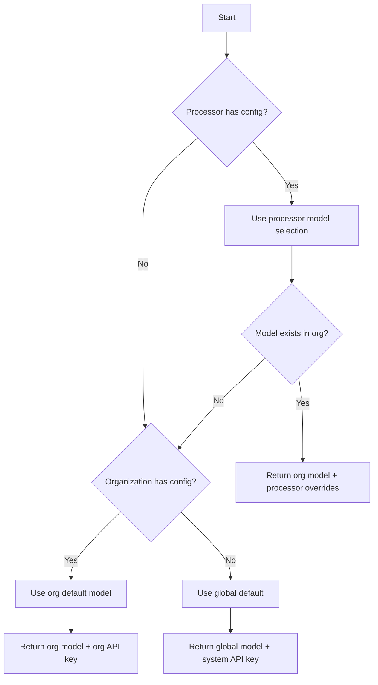

# LLM Provider Configuration Architecture

> **Last Updated:** 2025-10-29

## Overview

ValidAI implements a flexible 3-tier configuration hierarchy for managing Large Language Model (LLM) providers and their settings. This architecture allows for progressive customization from system-wide defaults down to processor-specific optimizations.

## Implementation Status

**Current Implementation (as of 2025-10-29):**

### ✅ Fully Implemented
- **Database Schema:** All tables, columns, and functions are in place and working
  - `validai_llm_global_settings` table with seeded Anthropic and Mistral models
  - `organizations.llm_configuration` JSONB column
  - `validai_processors.configuration` JSONB column
- **Database Functions:** All resolution and configuration functions operational
  - `get_llm_config_for_run()` - Resolves configuration through 3-tier hierarchy
  - `set_organization_llm_config()` - Saves organization settings with encryption
  - `get_available_llm_models()` - Returns available models
- **TypeScript Types:** Complete type definitions in `lib/types/llm-config.types.ts`
- **React Hooks:** All hooks implemented in `hooks/use-llm-config.ts`
- **Edge Functions:** Production run execution fully integrated with LLM config resolution
- **Security:** API key encryption and global fallback working

### ⚠️ Architecturally Ready, UI Pending
- **Processor Model Selection:** Database supports `selected_model_id` in `validai_processors.configuration`, but no UI to set it yet
- **Processor Settings Override:** Database supports `settings_override` for temperature/max_tokens, but no UI exists
- **Organization LLM Management:** Hooks are ready, but Pro/Enterprise admin UI not built

### 🔄 Current Behavior
- **All processors use global default model** (Claude Haiku 4.5) via automatic fallback
- **Organizations cannot configure custom API keys yet** (all use global `ANTHROPIC_API_KEY` and `MISTRAL_API_KEY` from Edge Function environment)
- **Processor configuration only stores** `default_run_view` field (for UI preference, not LLM settings)
- **System prompt is the only processor-level LLM customization** available through UI

### 📋 Roadmap
This document describes the **complete architecture** as designed. Implementation priority:
1. ✅ **Phase 1 (Complete):** Core database schema and resolution logic
2. ⏳ **Phase 2 (Pending):** Processor model selection UI
3. ⏳ **Phase 3 (Pending):** Organization LLM configuration UI (Pro/Enterprise feature)
4. ⏳ **Phase 4 (Future):** Advanced settings overrides and usage analytics

## Configuration Hierarchy

The system follows a strict 3-level hierarchy where each level can override the settings from the level above:

```
┌─────────────────────┐
│   Global Settings   │ ← System defaults (all users)
└──────────┬──────────┘
           │
           ▼
┌─────────────────────┐
│ Organization Config │ ← Custom API keys & models (Pro/Enterprise)
└──────────┬──────────┘
           │
           ▼
┌─────────────────────┐
│  Processor Config   │ ← Task-specific overrides
└─────────────────────┘
```

### 1. Global Level (System Defaults)

**Table**: `validai_llm_global_settings`

The global level provides system-wide defaults that are available to all users. These are managed by system administrators and serve as the fallback when no custom configuration exists.

**Key Features**:
- Multiple models can be registered
- One model marked as `is_default`
- System provides API keys (users don't need their own)
- Base configuration settings (temperature, max_tokens, etc.)

**Example Global Settings**:
```json
{
  "provider": "anthropic",
  "model_name": "claude-3-5-sonnet-20241022",
  "display_name": "Claude 3.5 Sonnet",
  "is_default": true,
  "configuration": {
    "default_temperature": 1.0,
    "default_max_tokens": 4096,
    "default_top_p": 1.0,
    "context_window": 200000,
    "supports_top_p": true
  }
}
```

**Model Capabilities**:

Models may have restrictions on which API parameters they support. The `supports_top_p` flag indicates whether a model can accept both `temperature` and `top_p` parameters simultaneously:

- **Claude 4.5 models** (Haiku 4.5, Sonnet 4.5): `supports_top_p: false`
  - These models only accept `temperature` parameter
  - Attempting to send both parameters results in API error
- **Claude 3.x models** (3.5 Sonnet, 3.5 Haiku, 3 Opus): `supports_top_p: true`
  - These models accept both `temperature` and `top_p` parameters
  - Both can be used for sampling control

The LLM executor automatically handles this by conditionally including `top_p` based on model capabilities.

### 2. Organization Level (Custom Configuration)

**Column**: `organizations.llm_configuration`

Organizations with Pro or Enterprise accounts can configure their own LLM settings, including:
- Custom API keys (encrypted)
- Available models for their users
- Organization-wide default model
- Override global settings

**Data Structure**:
```json
{
  "api_keys_encrypted": {
    "anthropic": "encrypted_key_here",
    "mistral": "encrypted_key_here"
  },
  "available_models": [
    {
      "id": "sonnet",
      "provider": "anthropic",
      "model": "claude-3-5-sonnet-20241022",
      "display_name": "Fast & Smart"
    },
    {
      "id": "opus",
      "provider": "anthropic",
      "model": "claude-3-opus-20240229",
      "display_name": "Most Capable"
    },
    {
      "id": "mistral",
      "provider": "mistral",
      "model": "mistral-large-latest",
      "display_name": "Cost Effective"
    }
  ],
  "default_model_id": "sonnet"
}
```

### 3. Processor Level (Fine-tuned Control)

**Column**: `validai_processors.configuration`

Individual processors can select specific models and override settings for their particular use case.

**Data Structure (Designed)**:
```json
{
  "selected_model_id": "opus",
  "settings_override": {
    "temperature": 0.2,
    "max_tokens": 8192
  },
  "default_run_view": "technical"
}
```

**Current Implementation Note:**
- ⚠️ `selected_model_id` and `settings_override` are **supported by the database and resolution logic** but have **no UI yet**
- ✅ `default_run_view` is the only field currently settable via UI (determines which view to show on run detail page)
- In practice, processors currently use organization or global defaults for LLM configuration
- System prompt (stored in `validai_processors.system_prompt` column, not in `configuration`) is the primary processor-level customization available

## Resolution Logic

The system resolves configuration using the `get_llm_config_for_run()` function, which follows this logic:



### Resolution Example

Given:
- **Global**: Claude Sonnet as default
- **Organization**: Has Anthropic + Mistral keys, Sonnet as default
- **Processor**: Selects Opus with temperature 0.2

Result:
```json
{
  "provider": "anthropic",
  "model": "claude-3-opus-20240229",
  "display_name": "Most Capable",
  "api_key_encrypted": "org_encrypted_key",
  "organization_id": "org_uuid",
  "settings": {
    "temperature": 0.2,  // Processor override
    "max_tokens": 8192   // From processor
  }
}
```

## Database Implementation

### Core Tables and Functions

#### Tables
- `validai_llm_global_settings` - Stores all available models and their default configurations
- `organizations.llm_configuration` - JSONB column for organization-specific settings
- `validai_processors.configuration` - JSONB column for processor-specific settings

#### Key Functions

1. **`get_llm_config_for_run(processor_id)`**
   - Main resolution function
   - Returns fully resolved configuration
   - Handles the 3-tier hierarchy

2. **`set_organization_llm_config(api_keys, models, default_model_id)`**
   - Updates organization configuration
   - Encrypts API keys automatically
   - Validates model structure

3. **`get_available_llm_models()`**
   - Returns models available to current user
   - Shows organization models if configured
   - Falls back to global models

4. **`encrypt_api_key(plaintext, org_id)` / `decrypt_api_key(ciphertext, org_id)`**
   - Handles secure API key storage
   - Organization-specific encryption
   - Decrypt restricted to service role

## Security Architecture

### API Key Storage

**Current Implementation (Pre-Production):**
- Global API keys stored in Edge Function environment variables:
  - `ANTHROPIC_API_KEY` for Claude models
  - `MISTRAL_API_KEY` for Mistral models
- Enables immediate testing without organization setup
- Used as fallback when organization has no custom key
- Suitable for beta/preview deployments

**Organization-Level Keys (Enterprise Feature):**
API keys are encrypted using pgcrypto with organization-specific keys:

```
Plaintext API Key
       ↓
[Encrypt with org_id + secret]
       ↓
Base64 Encoded Ciphertext
       ↓
Stored in organizations.llm_configuration.api_keys_encrypted
```

**Security Features**:
- Keys encrypted at rest
- Organization-specific encryption keys
- Decrypt function restricted to service role
- Keys never sent to client

**Edge Function Resolution:**
```typescript
// Priority: Organization key → Global env var
const provider = llmConfig.provider || 'anthropic'

if (llmConfig.api_key_encrypted) {
  // Use organization's custom key (decrypts with org-specific key)
  apiKey = await decrypt_api_key(llmConfig.api_key_encrypted, org_id)
} else {
  // Fallback to global key based on provider
  if (provider === 'mistral') {
    apiKey = Deno.env.get('MISTRAL_API_KEY')
  } else {
    apiKey = Deno.env.get('ANTHROPIC_API_KEY')
  }
}
```

### Access Control

Current implementation:
- All users use global API key by default
- Organization custom keys require encryption setup
- Decrypt function limited to service role

Future implementation:
- Role-based access (admin, member, viewer)
- Plan-based features (free: global key, pro/enterprise: custom keys)
- Audit logging for configuration changes

## Mistral Integration

**Status:** ✅ **Fully Implemented** (2025-10-29)

ValidAI now supports Mistral AI models alongside Anthropic Claude models, giving organizations choice in their AI providers.

### Available Mistral Models

| Model | Display Name | Context Window | Best For |
|-------|-------------|----------------|----------|
| `mistral-small-latest` | Mistral Small Latest | 128k tokens | Cost-effective document processing, routine tasks, multilingual content |
| `mistral-large-latest` | Mistral Large Latest | 128k tokens | Complex analysis, high-accuracy extraction, advanced multilingual processing |

### Key Differences vs Anthropic

| Feature | Anthropic (Claude) | Mistral |
|---------|-------------------|---------|
| **Prompt Caching** | ✅ Yes (90% cost savings) | ❌ No |
| **Extended Thinking** | ✅ Yes (reasoning mode) | ❌ No |
| **Structured Output** | ✅ Strict validation | ⚠️ Best-effort JSON mode |
| **Document Processing** | ✅ Direct base64 encoding | ⚠️ Upload step required (2-3s) |
| **API Key Fallback** | `ANTHROPIC_API_KEY` | `MISTRAL_API_KEY` |
| **Context Window** | 200k tokens | 128k tokens |
| **Multilingual** | ✅ Good | ✅ Excellent |

### Architecture Implementation

**Implementation Files:**
- `supabase/functions/_shared/llm-executor-router.ts` - Factory pattern router for multi-provider dispatch
- `supabase/functions/_shared/llm-executor-mistral.ts` - Mistral-specific executor (~438 lines)
- `supabase/functions/_shared/llm-executor.ts` - Anthropic executor (existing)
- `supabase/functions/_shared/types.ts` - Shared TypeScript types with `LLMProvider` enum
- `supabase/functions/execute-processor-run/index.ts` - Production run orchestration
- `supabase/functions/execute-workbench-test/index.ts` - Workbench testing endpoint

**Provider Routing (Factory Pattern):**
```typescript
// supabase/functions/_shared/llm-executor-router.ts
export async function executeLLMOperationWithRetryRouter(
  params: LLMExecutionParams,
  supabase: any,
  signedDocumentUrl?: string
): Promise<LLMExecutionResult> {
  const provider = params.settings.provider || 'anthropic'

  // Route to provider-specific executor
  if (provider === 'mistral') {
    return executeLLMOperationMistralWithRetry(params, supabase, signedDocumentUrl)
  } else {
    return executeLLMOperationWithRetry(params, supabase)
  }
}
```

**Document Handling (Mistral-specific):**
```typescript
// For Mistral: Upload once per run, reuse signed URL
// Initial invocation (execute-processor-run):
const mistralDocumentUrl = await uploadDocumentToMistral(
  mistralClient,
  documentBuffer,
  document.name
)

// Store in run snapshot
snapshot.mistral_document_url = mistralDocumentUrl

// Background processing: Reuse URL for all operations
for (const operation of operations) {
  const result = await executeLLMOperationMistral(
    params,
    supabase,
    snapshot.mistral_document_url  // Reuse signed URL (valid 24 hours)
  )
}
```

**API Key Resolution:**
```typescript
// Priority: Organization key → Global env var
if (provider === 'mistral') {
  if (llmConfig.api_key_encrypted) {
    apiKey = await decrypt_api_key(llmConfig.api_key_encrypted, org_id)
  } else {
    apiKey = Deno.env.get('MISTRAL_API_KEY')  // Global fallback
  }
}
```

### Cost Implications

**⚠️ Important:** Mistral models do NOT support prompt caching. This has significant cost implications for multi-operation processor runs.

**Cost Comparison Example (100 operations on same document):**

| Provider | Caching | Approximate Cost |
|----------|---------|------------------|
| Anthropic with caching | 90% cache hit rate | ~$1.50 |
| Mistral without caching | No caching | ~$10.50 |
| **Cost Difference** | | **~7x more expensive** |

**When Mistral is Cost-Effective:**
- Single-operation processors (similar cost to Anthropic)
- Small document batches (1-5 operations)
- Mistral Small is cheaper than Claude Sonnet for baseline pricing

**When Anthropic is More Cost-Effective:**
- Multi-operation processors (10+ operations on same document)
- Repeated processing of same documents
- High-volume production workloads

### Recommended Use Cases

**Use Mistral When:**
- ✅ Multilingual document processing (Mistral excels at non-English languages)
- ✅ Cost-sensitive single-operation workloads
- ✅ Regulatory requirements mandate provider diversity
- ✅ Testing provider redundancy and fallback strategies
- ✅ Workloads where prompt caching provides minimal benefit

**Use Anthropic When:**
- ✅ Multi-operation processor runs (caching saves 90% on costs)
- ✅ Complex reasoning tasks requiring thinking mode
- ✅ Maximum structured output reliability needed
- ✅ Document processing speed is critical (no upload overhead)
- ✅ Large context windows required (200k vs 128k)

### Structured Output Handling

Mistral uses JSON mode with manual validation, not Anthropic's strict Zod schema enforcement:

```typescript
// Anthropic: Automatic Zod validation
const response = await generateText({
  experimental_output: Output.object({ schema: zodSchema })
})
// → response.experimental_output is type-safe and validated

// Mistral: Manual validation with fallback
const response = await mistralClient.chat.complete({
  responseFormat: { type: 'json_object' }
})

try {
  const parsed = JSON.parse(response.content)
  const validated = zodSchema.parse(parsed)  // Manual validation
} catch (error) {
  console.warn('Validation failed, storing raw JSON')
  // Store raw + error, continue processing (graceful degradation)
}
```

**Validation Strategy:**
- Parse JSON response manually
- Validate against operation type Zod schema
- On error: Store raw JSON + log warning (don't fail run)
- Continue processing remaining operations

### Known Limitations

1. **No Prompt Caching**
   - Impact: 7x higher costs for multi-operation runs
   - Mitigation: Use for single-operation processors or accept higher costs

2. **No Extended Thinking Mode**
   - Impact: Cannot use reasoning/analysis features
   - Mitigation: Use Anthropic models for complex reasoning tasks

3. **Document Upload Overhead**
   - Impact: Initial 2-3 second delay per run
   - Mitigation: Amortized across operations (signed URL reused)

4. **Less Strict Structured Output**
   - Impact: May produce unexpected field names/types
   - Mitigation: Validation with graceful fallback to raw JSON

### Configuration

**Environment Variables (Supabase Edge Functions):**
```bash
# Set global Mistral API key
npx supabase secrets set MISTRAL_API_KEY=your_mistral_api_key

# Set global Anthropic API key (for comparison)
npx supabase secrets set ANTHROPIC_API_KEY=your_anthropic_api_key
```

**Organization-Level Keys (Pro/Enterprise):**
```typescript
// Organizations can set provider-specific keys
const llmConfig = {
  api_keys_encrypted: {
    anthropic: 'encrypted_claude_key',
    mistral: 'encrypted_mistral_key'
  },
  available_models: [
    {
      id: 'sonnet',
      provider: 'anthropic',
      model: 'claude-3-5-sonnet-20241022',
      display_name: 'Claude Sonnet'
    },
    {
      id: 'mistral-small',
      provider: 'mistral',
      model: 'mistral-small-latest',
      display_name: 'Mistral Small'
    }
  ],
  default_model_id: 'sonnet'  // Organization default
}
```

### Provider Detection

The system automatically determines the provider from the selected model:

1. **Model Selection in UI** → User selects "Mistral Small Latest" from workbench or processor config
2. **Database Lookup** → Query `validai_llm_global_settings` for model's `provider` field
3. **Provider Routing** → `llm-executor-router.ts` dispatches to provider-specific executor
4. **API Key Resolution** → Resolve API key (organization-specific or global `MISTRAL_API_KEY`)
5. **Execution** → Use Mistral-specific flow (document upload, JSON mode, structured output parsing)

### Migration Impact

The Mistral integration is **additive only** with zero breaking changes:

- ✅ Existing processors continue using Anthropic unchanged
- ✅ New model options appear in UI dropdowns automatically
- ✅ Users opt-in by selecting Mistral models
- ✅ No code changes required for existing processors
- ✅ Rollback: Delete Mistral rows from `validai_llm_global_settings`

### Testing Mistral Integration

```sql
-- Verify Mistral models are available in database
SELECT provider, model_name, display_name, is_active
FROM validai_llm_global_settings
WHERE provider = 'mistral'
ORDER BY model_name;

-- Expected result: 2 models (mistral-small-latest, mistral-large-latest)

-- Create test processor with Mistral model selection (optional, no UI yet)
INSERT INTO validai_processors (name, organization_id, configuration)
VALUES (
  'Mistral Test Processor',
  'your_org_id',  -- Replace with actual organization UUID
  jsonb_build_object('selected_model_id', 'mistral-small-latest')
);

-- Note: Currently, users select Mistral models via workbench UI dropdown
-- Processor-level model selection has no UI yet but works programmatically
```

**Edge Function Logs to Verify:**
```
[Mistral] Uploading document: test.pdf (52348 bytes)
[Mistral] File uploaded successfully: file-abc123
[Mistral] Signed URL obtained: https://files.mistral.ai/...
[Router] Routing to mistral executor
Reusing Mistral signed URL from snapshot
✅ Mistral call completed in 2845ms
✅ Structured output parsed: {"traffic_light":"green","comment":"..."}
```

**How to Use Mistral Models:**

1. **Workbench Testing (Available Now):**
   - Navigate to Workbench page in ValidAI app
   - Click model selector dropdown
   - Select "Mistral Small Latest" or "Mistral Large Latest"
   - Upload a test document
   - Configure operation (extraction, validation, etc.)
   - Click "Run Test"
   - View structured output and token usage

2. **Processor Runs (Programmatic Only - No UI Yet):**
   ```sql
   -- Set processor to use Mistral model
   UPDATE validai_processors
   SET configuration = jsonb_build_object(
     'selected_model_id', 'mistral-small-latest',
     'default_run_view', 'technical'
   )
   WHERE id = 'your_processor_id';
   ```
   - Future: UI will allow model selection in processor settings
   - Current: Processors use global default (Claude Haiku 4.5) unless manually updated

3. **API Key Configuration (One-Time Setup):**
   ```bash
   # Set global Mistral API key (already done in production)
   npx supabase secrets set MISTRAL_API_KEY=your_mistral_api_key
   ```

### Future Enhancements

**Planned Mistral Features:**
- RAG (Retrieval-Augmented Generation) integration
- Dedicated OCR API endpoint utilization
- Mistral-specific advanced features as they become available
- Cost optimization strategies for multi-operation runs

**Extensibility:**
The router architecture supports easy addition of new providers:
```typescript
// Future: Add OpenAI, Google, Cohere, etc.
const executors = {
  anthropic: executeLLMOperation,
  mistral: executeLLMOperationMistral,
  openai: executeLLMOperationOpenAI,      // Future
  google: executeLLMOperationGoogle,      // Future
  cohere: executeLLMOperationCohere,      // Future
}
```

## Usage Patterns

### Setting Organization Configuration

> **⚠️ UI Status:** Hook is implemented and ready, but admin UI for organization LLM configuration is not yet built. This is a planned Pro/Enterprise feature.

```typescript
// React component using the hook
import { useSetOrganizationLLMConfig } from '@/hooks/use-llm-config';

function LLMSettings() {
  const setConfig = useSetOrganizationLLMConfig();

  const saveConfiguration = async () => {
    await setConfig.mutateAsync({
      api_keys: {
        anthropic: 'sk-ant-...',
        mistral: 'ml-key-...'
      },
      available_models: [
        {
          id: 'sonnet',
          provider: 'anthropic',
          model: 'claude-3-5-sonnet-20241022',
          display_name: 'Claude Sonnet'
        }
      ],
      default_model_id: 'sonnet'
    });
  };
}
```

### Getting Available Models

```typescript
import { useAvailableLLMModels } from '@/hooks/use-llm-config';

function ModelSelector() {
  const { data: models } = useAvailableLLMModels();

  // models.source: 'organization' | 'global'
  // models.models: array of available models
  // models.default_model_id: current default
}
```

### Processor Configuration

> **⚠️ UI Status:** Database and resolution logic support `selected_model_id` and `settings_override`, but no UI exists to set these fields yet. Current UI only allows setting `default_run_view` and `system_prompt` (separate column).

```typescript
// When creating/editing a processor (future implementation)
const processorConfig = {
  selected_model_id: 'opus',  // Select from available models (no UI yet)
  settings_override: {
    temperature: 0.2  // Override for this processor (no UI yet)
  },
  default_run_view: 'technical'  // ✅ Currently settable via UI
};

// Save to validai_processors.configuration column
await updateProcessor({
  configuration: processorConfig
});
```

### Resolving Configuration at Runtime

> **✅ Fully Implemented:** This works end-to-end in Edge Functions during processor runs.

```typescript
import { useResolvedLLMConfig } from '@/hooks/use-llm-config';

function RunProcessor({ processorId }: { processorId: string }) {
  const { data: llmConfig } = useResolvedLLMConfig(processorId);

  // llmConfig contains:
  // - provider: 'anthropic'
  // - model: 'claude-3-5-sonnet-20241022' (currently always global default)
  // - api_key_encrypted: null (currently always uses global ANTHROPIC_API_KEY)
  // - settings: { default_temperature: 1.0, default_max_tokens: 4096, ... }
}
```

## Account Type Behaviors

> **Note:** Account tier differentiation is architecturally designed but not enforced in current UI. All accounts currently behave like Free accounts.

### Free Accounts
- Use global default models ✅ **Current behavior for all accounts**
- System provides API keys ✅ **Current behavior for all accounts**
- Cannot customize settings
- Single model selection

### Pro Accounts (Planned)
- Add custom API keys ⏳ Database ready, UI pending
- Select from multiple models ⏳ Database ready, UI pending
- Set organization defaults ⏳ Database ready, UI pending
- Override global settings ⏳ Database ready, UI pending

### Enterprise Accounts (Future)
- All Pro features
- Processor-level optimization ⏳ Database ready, UI pending
- Usage analytics 📋 Planned
- Custom model endpoints 📋 Planned
- Audit logging 📋 Planned

## Migration Path

### Phase 1 (Current)
- Basic 3-tier hierarchy
- Encrypted API key storage
- Simple resolution logic
- No access controls

### Phase 2 (Planned)
- Migrate to Supabase Vault when stable
- Add role-based access controls
- Implement usage tracking
- Add audit logging

### Vault Migration

When Supabase Vault becomes stable, migration will be straightforward:

```sql
-- Move encrypted keys from JSONB to Vault
INSERT INTO vault.secrets (name, secret)
SELECT
  format('org_%s_%s', org_id, provider),
  decrypt_api_key(api_key, org_id)
FROM organization_api_keys;

-- Update configuration to use vault references
UPDATE organizations
SET llm_configuration = jsonb_set(
  llm_configuration,
  '{api_key_vault_ref}',
  '"org_uuid_provider"'
);
```

## Best Practices

### For Developers

1. **Always use the resolution function**
   ```typescript
   // Good
   const config = await supabase.rpc('get_llm_config_for_run', { processor_id });

   // Bad - Don't manually traverse hierarchy
   const org = await getOrganization();
   const config = org.llm_configuration || globalDefault;
   ```

2. **Never decrypt API keys client-side**
   - Decryption happens in Edge Functions only
   - Client receives encrypted keys or null

3. **Cache configuration appropriately**
   - Use React Query's built-in caching
   - Invalidate on configuration changes

### For Organizations

1. **Start with defaults**
   - Test with global settings first
   - Add custom configuration when needed

2. **Use model IDs consistently**
   - Define clear, memorable IDs
   - Document model purposes

3. **Optimize processor settings**
   - Legal docs: Lower temperature (0.2)
   - Creative tasks: Higher temperature (0.8)
   - Analysis: Balanced settings (0.5)

## Troubleshooting

### Common Issues

1. **No configuration returned**
   - Check organization context in JWT
   - Verify global default exists
   - Ensure models are marked `is_active`

2. **Wrong model selected**
   - Check processor's `selected_model_id`
   - Verify model exists in organization's available models
   - Check organization's `default_model_id`

3. **API key decryption fails**
   - Verify encryption used correct org_id
   - Check service role permissions
   - Ensure key was encrypted with current function

4. **Error: "temperature and top_p cannot both be specified"**
   - This error occurs with Claude 4.5 models (Haiku 4.5, Sonnet 4.5)
   - Verify model configuration has `supports_top_p: false` set
   - Check migration `add_llm_model_capabilities` has been applied
   - LLM executor should automatically exclude `top_p` for these models
   - If error persists, check Edge Function logs for parameter detection logic

### Debug Queries

```sql
-- Check current user's organization context from JWT
SELECT auth.jwt() -> 'app_metadata' ->> 'organization_id' AS current_org_id;

-- View organization LLM configuration (if custom keys/models set)
SELECT id, name, llm_configuration
FROM organizations
WHERE id = 'org_uuid';  -- Replace with your organization UUID

-- Test full configuration resolution for a processor
SELECT get_llm_config_for_run('processor_uuid');  -- Replace with actual processor UUID

-- View all available models (respects organization context)
SELECT * FROM get_available_llm_models();

-- Check all active models in database (global level)
SELECT provider, model_name, display_name, is_default, is_active
FROM validai_llm_global_settings
WHERE is_active = true
ORDER BY provider, model_name;

-- View specific processor configuration
SELECT id, name, configuration, system_prompt
FROM validai_processors
WHERE id = 'processor_uuid';  -- Replace with actual processor UUID
```

## Future Enhancements

### Planned Features

1. **Model Versioning**
   - Track model version changes
   - Maintain compatibility

2. **Usage Analytics**
   - Token consumption per model
   - Cost tracking by organization
   - Performance metrics

3. **Advanced Features**
   - Custom model endpoints
   - Self-hosted model support
   - Model routing based on load

4. **Governance**
   - Audit trail for changes
   - Compliance reporting
   - Data residency controls

### Extension Points

The architecture supports future extensions:
- Additional providers (AWS Bedrock, Azure OpenAI)
- Custom models and endpoints
- Complex routing rules
- Dynamic model selection based on document type

## Summary

The 3-tier LLM configuration system provides:
- **Flexibility**: Organizations control their AI usage
- **Simplicity**: Clear hierarchy and resolution
- **Security**: Encrypted API keys, never exposed
- **Scalability**: Supports multiple providers and models
- **Future-proof**: Ready for Vault and advanced features

This architecture enables ValidAI to support diverse customer needs from free users with defaults to enterprises with complex requirements, all while maintaining security and simplicity.