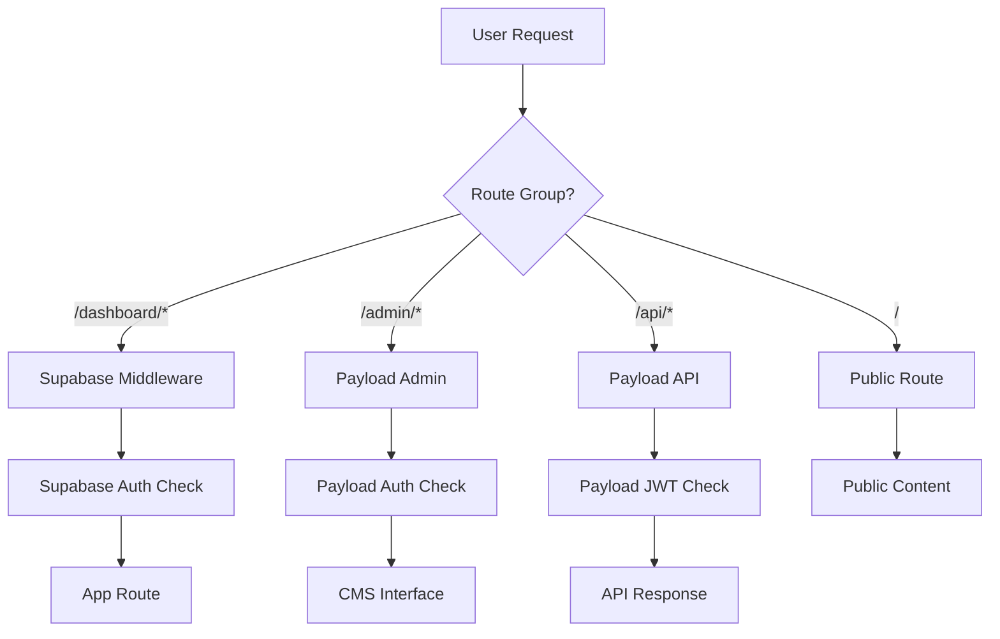

# CMS Architecture Documentation

## Overview

ValidAI uses a **monolith architecture** with Payload CMS integrated into the Next.js application to handle all unauthenticated content management. The authenticated application remains separate but shares the same codebase and database instance.

### Architecture Principles

- **Single Application**: Both CMS and app run in the same Next.js process
- **Schema Separation**: Same PostgreSQL database, different schemas (`public` vs `payload`)
- **Dual Authentication**: Supabase Auth for app users, Payload Auth for CMS users
- **API Separation**: CMS uses traditional REST/GraphQL APIs, App uses PostgREST
- **Future-Ready**: Designed to allow separation into microservices later

## Route Architecture

The application uses **Next.js Route Groups** to organize different concerns:

### Route Group Structure

```
app/
├── (app)/          # Authenticated application routes
├── (payload)/      # CMS routes (admin interface and APIs)
├── (public)/       # Public content routes
└── layout.tsx      # Root layout (minimal pass-through)
```

### URL Patterns

| Route Group | URL Pattern | Purpose | Authentication |
|-------------|-------------|---------|----------------|
| `(app)`     | `/dashboard/*` | Main application | Supabase Auth |
| `(app)`     | `/auth/*` | App authentication | None |
| `(payload)` | `/admin/*` | CMS admin interface | Payload Auth |
| `(payload)` | `/api/*` | CMS REST API | Payload Auth |
| `(payload)` | `/graphql` | CMS GraphQL API | Payload Auth |
| `(public)`  | `/` | Public homepage | None |

### Route Group Details

#### (app) Route Group
- **Layout**: Full HTML structure with providers, themes, notifications
- **Authentication**: Supabase-based user management
- **Data Access**: Direct PostgREST queries to `public` schema
- **Protected Routes**: `/dashboard/*` (via middleware)
- **Auth Routes**: `/auth/*` (login, signup, password reset, etc.)

#### (payload) Route Group
- **Layout**: Payload's React-based admin interface
- **Authentication**: Payload's built-in user management
- **Data Access**: Payload's REST/GraphQL APIs to `payload` schema
- **Admin Interface**: `/admin/*` (managed by Payload)
- **API Endpoints**: `/api/*` (auto-generated by Payload)
- **GraphQL**: `/graphql` (optional API endpoint)

#### (public) Route Group
- **Layout**: Simple public-facing layout
- **Authentication**: None required
- **Content Source**: Payload CMS collections
- **Purpose**: Public content display (homepage, blog posts, etc.)

## API Architecture

The application uses **two distinct API approaches**:

### Payload CMS API (Traditional)

**Endpoint Pattern**: `/api/*`
- **Type**: Traditional REST + GraphQL APIs
- **Generated**: Auto-generated by Payload from collections
- **Authentication**: JWT-based (Payload users)
- **Database**: `payload` schema via Payload ORM
- **Use Cases**: CMS operations, content management

**Key Endpoints**:
- `POST /api/users` - Create CMS users
- `GET /api/pages` - Fetch pages collection
- `POST /api/pages` - Create new pages
- `POST /api/graphql` - GraphQL endpoint

### App API (PostgREST Style)

**Access Pattern**: Direct client queries
- **Type**: Direct database queries via Supabase client
- **Authentication**: RLS policies + JWT (Supabase users)
- **Database**: `public` schema via PostgREST
- **Use Cases**: App functionality, user data

**Examples**:
```typescript
// Direct table access
const { data } = await supabase.from('todos').select('*')

// RPC function calls
const { data } = await supabase.rpc('get_user_stats')
```

## Middleware Configuration

### Current Middleware Setup

**File**: `middleware.ts`
**Purpose**: Supabase session management for app routes only

```typescript
export const config = {
  matcher: [
    "/dashboard/:path*",  // Only protect app dashboard routes
    // "/api/*" is excluded - Payload handles its own auth
  ],
};
```

### Middleware Responsibilities

| Middleware | Routes | Purpose |
|------------|--------|---------|
| Supabase | `/dashboard/*` | App session refresh, auth checks |
| Payload | `/admin/*`, `/api/*` | CMS authentication, admin access |
| None | `/`, `/auth/*` | Public access |

### Why No API Middleware

- **Payload APIs** (`/api/*`) handle their own authentication
- **App APIs** use direct PostgREST (no middleware needed)
- **Prevents conflicts** between Supabase and Payload auth systems

## Database Architecture

### Schema Separation Strategy

Both systems share the **same PostgreSQL instance** but use **different schemas**:

```sql
Database: postgres (Supabase)
├── public schema      # App data (Supabase managed)
│   ├── todos          # App tables
│   ├── profiles       # User profiles
│   └── ...            # Other app tables
│
└── payload schema     # CMS data (Payload managed)
    ├── users          # CMS admin users
    ├── pages          # Content pages
    ├── media          # File uploads
    └── payload_*      # Payload system tables
```

### Connection Strings

```bash
# App connections (public schema)
DATABASE_URL=postgresql://...@supabase.com:6543/postgres

# CMS connections (payload schema)
PAYLOAD_DATABASE_URI=postgresql://...@supabase.com:6543/postgres?schema=payload
```

### Benefits of Schema Separation

- **Data Isolation**: App and CMS data don't interfere
- **Security**: Different access patterns and permissions
- **Migration Independence**: Schema changes don't affect each other
- **Future Flexibility**: Easy to split into separate databases later

## Authentication Architecture

### Dual Authentication System

The application runs **two separate authentication systems**:

#### Supabase Auth (App Users)
- **Purpose**: Application user authentication
- **Tables**: `auth.users` (Supabase managed)
- **JWT**: Supabase-issued tokens
- **Middleware**: Custom middleware for session refresh
- **Flows**: Login, signup, password reset, magic links

#### Payload Auth (CMS Users)
- **Purpose**: Content management authentication
- **Tables**: `payload.users` (Payload managed)
- **JWT**: Payload-issued tokens
- **Middleware**: Built into Payload system
- **Flows**: Admin login, user management

### Authentication Flow Separation



## Environment Configuration

### Required Environment Variables

```bash
# Supabase (App)
NEXT_PUBLIC_SUPABASE_URL=https://xxx.supabase.co
NEXT_PUBLIC_SUPABASE_PUBLISHABLE_OR_ANON_KEY=eyJ...
SUPABASE_SERVICE_ROLE_KEY=eyJ...
DATABASE_URL=postgresql://...

# Payload CMS
PAYLOAD_SECRET=your-secret-key
PAYLOAD_DATABASE_URI=postgresql://...?schema=payload
```

### Configuration Files

- **`payload.config.ts`**: Payload CMS configuration
- **`lib/supabase/`**: Supabase client configurations
- **`middleware.ts`**: Route protection rules

## Development Workflow

### Starting the Application

```bash
npm run dev
```

This starts:
- **Next.js server** (handles all routes)
- **Payload admin** (available at `/admin`)
- **App interface** (available at `/dashboard`)

### Development URLs

- **App**: `http://localhost:3000/dashboard`
- **CMS Admin**: `http://localhost:3000/admin`
- **Public Site**: `http://localhost:3000/`
- **API**: `http://localhost:3000/api/*`
- **GraphQL**: `http://localhost:3000/graphql`

## Content Management Flow

### CMS Content Creation

1. **Access Admin**: Navigate to `/admin`
2. **Login**: Use Payload CMS credentials
3. **Create Content**: Use admin interface
4. **API Access**: Content available via `/api/pages` etc.

### App Content Consumption

```typescript
// In app components, fetch CMS content
const response = await fetch('/api/pages');
const pages = await response.json();
```

### Public Content Display

```typescript
// In public routes, display CMS content
const { docs: pages } = await fetch('/api/pages').then(r => r.json());
```

## Security Considerations

### Authentication Boundaries

- **App routes** (`/dashboard/*`): Protected by Supabase RLS
- **CMS routes** (`/admin/*`, `/api/*`): Protected by Payload auth
- **Public routes** (`/`): Open access

### Data Access Control

- **App Data**: Row Level Security (RLS) policies
- **CMS Data**: Payload's access control system
- **Cross-System**: No direct data sharing (by design)

## Future Architecture Considerations

### Microservice Separation Strategy

The current monolith is designed to support future separation:

#### Phase 1: Current (Monolith)
- Single Next.js app
- Shared database, separate schemas
- Route groups for organization

#### Phase 2: API Gateway
- Extract Payload to separate service
- Add API gateway for routing
- Keep Next.js for app frontend

#### Phase 3: Full Microservices
- Separate databases
- Independent deployments
- Service mesh architecture

### Migration Preparation

- **Schema separation** already in place
- **Authentication systems** are independent
- **API boundaries** clearly defined
- **Route groups** provide logical separation

## Troubleshooting

### Common Issues

1. **API Returns HTML Instead of JSON**
   - **Cause**: Middleware intercepting Payload routes
   - **Solution**: Ensure `/api/*` excluded from Supabase middleware

2. **CMS Admin Won't Load**
   - **Cause**: Missing environment variables
   - **Solution**: Check `PAYLOAD_SECRET` and `PAYLOAD_DATABASE_URI`

3. **Database Connection Errors**
   - **Cause**: Schema not specified or incorrect connection string
   - **Solution**: Verify `?schema=payload` in `PAYLOAD_DATABASE_URI`

### Debug Checklist

- [ ] Environment variables properly set
- [ ] Database schemas exist
- [ ] Middleware configuration correct
- [ ] No route conflicts between systems
- [ ] Authentication boundaries respected

## Conclusion

This architecture provides a robust foundation for content management while maintaining clear separation between the CMS and application concerns. The monolith approach simplifies development and deployment while preserving the flexibility to evolve into a microservices architecture as needs grow.