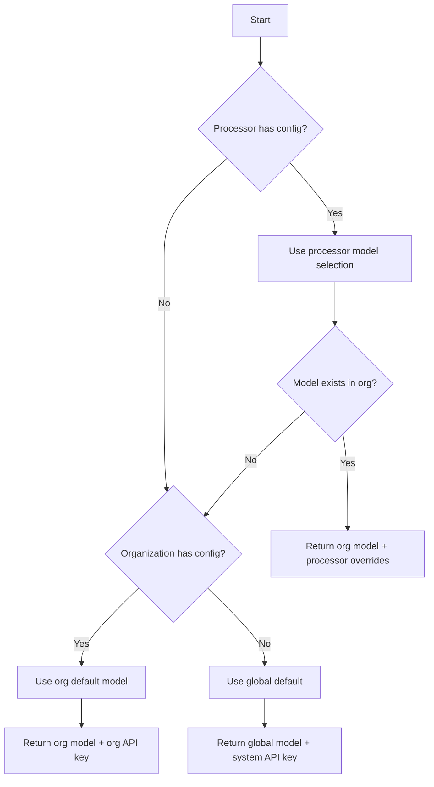

# LLM Provider Configuration Architecture

## Overview

ValidAI implements a flexible 3-tier configuration hierarchy for managing Large Language Model (LLM) providers and their settings. This architecture allows for progressive customization from system-wide defaults down to processor-specific optimizations.

## Configuration Hierarchy

The system follows a strict 3-level hierarchy where each level can override the settings from the level above:

```
┌─────────────────────┐
│   Global Settings   │ ← System defaults (all users)
└──────────┬──────────┘
           │
           ▼
┌─────────────────────┐
│ Organization Config │ ← Custom API keys & models (Pro/Enterprise)
└──────────┬──────────┘
           │
           ▼
┌─────────────────────┐
│  Processor Config   │ ← Task-specific overrides
└─────────────────────┘
```

### 1. Global Level (System Defaults)

**Table**: `llm_global_settings`

The global level provides system-wide defaults that are available to all users. These are managed by system administrators and serve as the fallback when no custom configuration exists.

**Key Features**:
- Multiple models can be registered
- One model marked as `is_default`
- System provides API keys (users don't need their own)
- Base configuration settings (temperature, max_tokens, etc.)

**Example Global Settings**:
```json
{
  "provider": "anthropic",
  "model_name": "claude-3-5-sonnet-20241022",
  "display_name": "Claude 3.5 Sonnet",
  "is_default": true,
  "configuration": {
    "temperature": 0.7,
    "max_tokens": 4096
  }
}
```

### 2. Organization Level (Custom Configuration)

**Column**: `organizations.llm_configuration`

Organizations with Pro or Enterprise accounts can configure their own LLM settings, including:
- Custom API keys (encrypted)
- Available models for their users
- Organization-wide default model
- Override global settings

**Data Structure**:
```json
{
  "api_keys_encrypted": {
    "anthropic": "encrypted_key_here",
    "mistral": "encrypted_key_here"
  },
  "available_models": [
    {
      "id": "sonnet",
      "provider": "anthropic",
      "model": "claude-3-5-sonnet-20241022",
      "display_name": "Fast & Smart"
    },
    {
      "id": "opus",
      "provider": "anthropic",
      "model": "claude-3-opus-20240229",
      "display_name": "Most Capable"
    },
    {
      "id": "mistral",
      "provider": "mistral",
      "model": "mistral-large-latest",
      "display_name": "Cost Effective"
    }
  ],
  "default_model_id": "sonnet"
}
```

### 3. Processor Level (Fine-tuned Control)

**Column**: `processors.configuration`

Individual processors can select specific models and override settings for their particular use case.

**Data Structure**:
```json
{
  "selected_model_id": "opus",
  "settings_override": {
    "temperature": 0.2,
    "max_tokens": 8192
  }
}
```

## Resolution Logic

The system resolves configuration using the `get_llm_config_for_run()` function, which follows this logic:



### Resolution Example

Given:
- **Global**: Claude Sonnet as default
- **Organization**: Has Anthropic + Mistral keys, Sonnet as default
- **Processor**: Selects Opus with temperature 0.2

Result:
```json
{
  "provider": "anthropic",
  "model": "claude-3-opus-20240229",
  "display_name": "Most Capable",
  "api_key_encrypted": "org_encrypted_key",
  "organization_id": "org_uuid",
  "settings": {
    "temperature": 0.2,  // Processor override
    "max_tokens": 8192   // From processor
  }
}
```

## Database Implementation

### Core Tables and Functions

#### Tables
- `llm_global_settings` - Stores all available models and their default configurations
- `organizations.llm_configuration` - JSONB column for organization-specific settings

#### Key Functions

1. **`get_llm_config_for_run(processor_id)`**
   - Main resolution function
   - Returns fully resolved configuration
   - Handles the 3-tier hierarchy

2. **`set_organization_llm_config(api_keys, models, default_model_id)`**
   - Updates organization configuration
   - Encrypts API keys automatically
   - Validates model structure

3. **`get_available_llm_models()`**
   - Returns models available to current user
   - Shows organization models if configured
   - Falls back to global models

4. **`encrypt_api_key(plaintext, org_id)` / `decrypt_api_key(ciphertext, org_id)`**
   - Handles secure API key storage
   - Organization-specific encryption
   - Decrypt restricted to service role

## Security Architecture

### API Key Storage

API keys are encrypted using pgcrypto with organization-specific keys:

```
Plaintext API Key
       ↓
[Encrypt with org_id + secret]
       ↓
Base64 Encoded Ciphertext
       ↓
Stored in JSONB
```

**Security Features**:
- Keys encrypted at rest
- Organization-specific encryption keys
- Decrypt function restricted to service role
- Keys never sent to client

### Access Control

Current implementation (Phase 1):
- All authenticated users can read global settings
- Users can modify their organization's configuration
- Decrypt function limited to service role

Future implementation (Phase 2):
- Role-based access (admin, member, viewer)
- Plan-based features (free, pro, enterprise)
- Audit logging for configuration changes

## Usage Patterns

### Setting Organization Configuration

```typescript
// React component using the hook
import { useSetOrganizationLLMConfig } from '@/hooks/use-llm-config';

function LLMSettings() {
  const setConfig = useSetOrganizationLLMConfig();

  const saveConfiguration = async () => {
    await setConfig.mutateAsync({
      api_keys: {
        anthropic: 'sk-ant-...',
        mistral: 'ml-key-...'
      },
      available_models: [
        {
          id: 'sonnet',
          provider: 'anthropic',
          model: 'claude-3-5-sonnet-20241022',
          display_name: 'Claude Sonnet'
        }
      ],
      default_model_id: 'sonnet'
    });
  };
}
```

### Getting Available Models

```typescript
import { useAvailableLLMModels } from '@/hooks/use-llm-config';

function ModelSelector() {
  const { data: models } = useAvailableLLMModels();

  // models.source: 'organization' | 'global'
  // models.models: array of available models
  // models.default_model_id: current default
}
```

### Processor Configuration

```typescript
// When creating/editing a processor
const processorConfig = {
  selected_model_id: 'opus',  // Select from available models
  settings_override: {
    temperature: 0.2  // Override for this processor
  }
};

// Save to processors.configuration column
await updateProcessor({
  configuration: processorConfig
});
```

### Resolving Configuration at Runtime

```typescript
import { useResolvedLLMConfig } from '@/hooks/use-llm-config';

function RunProcessor({ processorId }: { processorId: string }) {
  const { data: llmConfig } = useResolvedLLMConfig(processorId);

  // llmConfig contains:
  // - provider: 'anthropic'
  // - model: 'claude-3-opus-20240229'
  // - api_key_encrypted: 'encrypted_key' (decrypt server-side)
  // - settings: { temperature: 0.2, ... }
}
```

## Account Type Behaviors

### Free Accounts
- Use global default models
- System provides API keys
- Cannot customize settings
- Single model selection

### Pro Accounts
- Add custom API keys
- Select from multiple models
- Set organization defaults
- Override global settings

### Enterprise Accounts (Future)
- All Pro features
- Processor-level optimization
- Usage analytics
- Custom model endpoints
- Audit logging

## Migration Path

### Phase 1 (Current)
- Basic 3-tier hierarchy
- Encrypted API key storage
- Simple resolution logic
- No access controls

### Phase 2 (Planned)
- Migrate to Supabase Vault when stable
- Add role-based access controls
- Implement usage tracking
- Add audit logging

### Vault Migration

When Supabase Vault becomes stable, migration will be straightforward:

```sql
-- Move encrypted keys from JSONB to Vault
INSERT INTO vault.secrets (name, secret)
SELECT
  format('org_%s_%s', org_id, provider),
  decrypt_api_key(api_key, org_id)
FROM organization_api_keys;

-- Update configuration to use vault references
UPDATE organizations
SET llm_configuration = jsonb_set(
  llm_configuration,
  '{api_key_vault_ref}',
  '"org_uuid_provider"'
);
```

## Best Practices

### For Developers

1. **Always use the resolution function**
   ```typescript
   // Good
   const config = await supabase.rpc('get_llm_config_for_run', { processor_id });

   // Bad - Don't manually traverse hierarchy
   const org = await getOrganization();
   const config = org.llm_configuration || globalDefault;
   ```

2. **Never decrypt API keys client-side**
   - Decryption happens in Edge Functions only
   - Client receives encrypted keys or null

3. **Cache configuration appropriately**
   - Use React Query's built-in caching
   - Invalidate on configuration changes

### For Organizations

1. **Start with defaults**
   - Test with global settings first
   - Add custom configuration when needed

2. **Use model IDs consistently**
   - Define clear, memorable IDs
   - Document model purposes

3. **Optimize processor settings**
   - Legal docs: Lower temperature (0.2)
   - Creative tasks: Higher temperature (0.8)
   - Analysis: Balanced settings (0.5)

## Troubleshooting

### Common Issues

1. **No configuration returned**
   - Check organization context in JWT
   - Verify global default exists
   - Ensure models are marked `is_active`

2. **Wrong model selected**
   - Check processor's `selected_model_id`
   - Verify model exists in organization's available models
   - Check organization's `default_model_id`

3. **API key decryption fails**
   - Verify encryption used correct org_id
   - Check service role permissions
   - Ensure key was encrypted with current function

### Debug Queries

```sql
-- Check current user's organization
SELECT auth.jwt() -> 'app_metadata' ->> 'organization_id';

-- View organization configuration
SELECT llm_configuration
FROM organizations
WHERE id = 'org_uuid';

-- Test resolution
SELECT get_llm_config_for_run('processor_uuid');

-- View available models
SELECT get_available_llm_models();
```

## Future Enhancements

### Planned Features

1. **Model Versioning**
   - Track model version changes
   - Maintain compatibility

2. **Usage Analytics**
   - Token consumption per model
   - Cost tracking by organization
   - Performance metrics

3. **Advanced Features**
   - Custom model endpoints
   - Self-hosted model support
   - Model routing based on load

4. **Governance**
   - Audit trail for changes
   - Compliance reporting
   - Data residency controls

### Extension Points

The architecture supports future extensions:
- Additional providers (AWS Bedrock, Azure OpenAI)
- Custom models and endpoints
- Complex routing rules
- Dynamic model selection based on document type

## Summary

The 3-tier LLM configuration system provides:
- **Flexibility**: Organizations control their AI usage
- **Simplicity**: Clear hierarchy and resolution
- **Security**: Encrypted API keys, never exposed
- **Scalability**: Supports multiple providers and models
- **Future-proof**: Ready for Vault and advanced features

This architecture enables ValidAI to support diverse customer needs from free users with defaults to enterprises with complex requirements, all while maintaining security and simplicity.