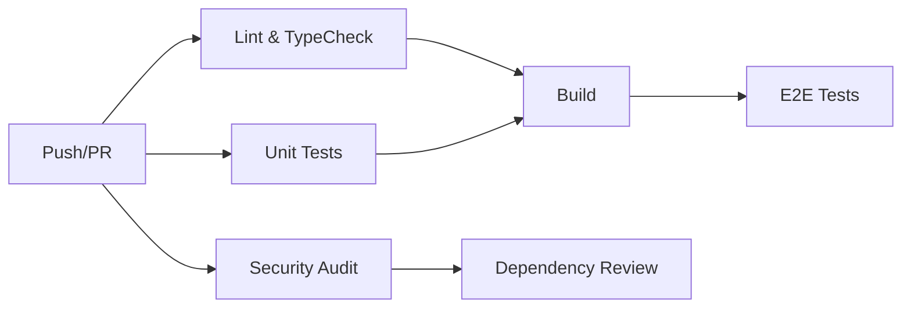

# CI/CD Process Documentation

## Overview

ValidAI uses GitHub Actions for continuous integration and deployment, ensuring code quality, security, and reliable deployments across all environments.

## Workflow Structure

### 1. CI Pipeline (`.github/workflows/ci.yml`)

The CI pipeline runs on every push and pull request, ensuring code quality and catching issues early.

#### Jobs Overview



#### Job Details

**1. Lint and Type Check** (`lint-and-typecheck`)
- **Purpose**: Ensures code follows style guidelines and type safety
- **Runs**: On every push/PR
- **Duration**: ~2-3 minutes
- **Tools**: ESLint, TypeScript compiler
- **Failure Impact**: Blocks PR merge

```yaml
steps:
  - ESLint: npm run lint
  - TypeScript: npm run typecheck
```

**2. Unit Tests** (`unit-tests`)
- **Purpose**: Validates component and function logic
- **Runs**: On every push/PR
- **Duration**: ~3-5 minutes
- **Coverage**: Uploads to Codecov
- **Failure Impact**: Blocks PR merge

```yaml
steps:
  - Run tests: npm run test:coverage
  - Upload coverage to Codecov
```

**3. Build** (`build`)
- **Purpose**: Ensures application builds successfully
- **Runs**: After lint/test jobs pass
- **Duration**: ~2-3 minutes
- **Environment**: Production build configuration
- **Failure Impact**: Blocks PR merge

**4. E2E Tests** (`e2e-tests`)
- **Purpose**: Validates critical user journeys
- **Runs**: On non-draft PRs and pushes to main
- **Duration**: ~10-15 minutes
- **Browsers**: Chromium, Firefox, Safari
- **Failure Impact**: Blocks PR merge
- **Artifacts**: Playwright reports on failure

**5. Security Audit** (`security-audit`)
- **Purpose**: Identifies security vulnerabilities
- **Runs**: On every push/PR
- **Duration**: ~1-2 minutes
- **Tools**: npm audit
- **Threshold**: High-severity vulnerabilities fail the build

**6. Dependency Review** (`dependency-review`)
- **Purpose**: Reviews new dependencies for security issues
- **Runs**: On pull requests only
- **Duration**: ~1 minute
- **Tool**: GitHub's dependency review action

### 2. Deployment Pipeline (`.github/workflows/deploy.yml`)

The deployment pipeline handles staging and production deployments.

#### Staging Deployment

**Triggers**:
- Push to `main` branch
- Manual workflow dispatch

**Process**:
1. Run full test suite
2. Build with staging environment variables
3. Deploy to staging environment
4. Run smoke tests against staging
5. Notify team of deployment status

**Environment Variables**:
- `STAGING_SUPABASE_URL`
- `STAGING_SUPABASE_ANON_KEY`

#### Production Deployment

**Triggers**:
- Successful staging deployment
- Manual approval required

**Process**:
1. Build with production environment variables
2. Deploy to production environment
3. Run production smoke tests
4. Send deployment notifications
5. Monitor for rollback triggers

**Environment Variables**:
- `PRODUCTION_SUPABASE_URL`
- `PRODUCTION_SUPABASE_ANON_KEY`

## Branch Strategy

### Main Branches

- **`main`**: Production-ready code
  - Protected branch
  - Requires PR reviews
  - All CI checks must pass
  - Automatically deploys to staging

- **`develop`**: Integration branch for features
  - Triggers CI pipeline
  - Used for feature integration
  - Merges to main via PR

### Feature Branches

- **Naming**: `feat/feature-name`, `fix/bug-name`, `docs/update-name`
- **Lifetime**: Short-lived, deleted after merge
- **CI**: Full CI pipeline runs on every push

### Branch Protection Rules

**Main Branch**:
- Require pull request reviews (1 reviewer minimum)
- Require status checks to pass
- Require branches to be up to date
- Restrict pushes to admins only
- Require linear history

**Develop Branch**:
- Require status checks to pass
- Allow force pushes from admins

## Environment Management

### Development Environment

**Setup**:
- Local development with `.env.local`
- Supabase local development instance
- Hot reload with Turbopack

**Testing**:
- Unit tests with mocked Supabase client
- E2E tests against local development server

### Staging Environment

**Purpose**: Pre-production validation
**URL**: `https://staging.validai.app` (example)
**Database**: Separate Supabase project
**Deployment**: Automatic on main branch push

**Features**:
- Production-like environment
- Automated smoke tests
- Performance monitoring
- Error tracking

### Production Environment

**Purpose**: Live application
**URL**: `https://validai.app` (example)
**Database**: Production Supabase project
**Deployment**: Manual approval required

**Features**:
- Blue-green deployment strategy
- Automated rollback on critical failures
- Comprehensive monitoring
- Error alerting

## Quality Gates

### Pull Request Requirements

Before a PR can be merged to main:

1. **Code Review**: At least 1 approving review
2. **CI Checks**: All CI jobs must pass
3. **Coverage**: Maintain or improve test coverage
4. **Documentation**: Update relevant documentation
5. **Breaking Changes**: Follow semantic versioning

### Automated Checks

**Lint Rules**:
- ESLint with Next.js configuration
- Prettier for code formatting
- Tailwind CSS class sorting

**Type Safety**:
- TypeScript strict mode
- No `any` types without explicit justification
- Proper interface definitions

**Testing Requirements**:
- Unit tests for new components
- Integration tests for new features
- E2E tests for critical user paths
- Minimum 80% code coverage

**Security Requirements**:
- No high-severity vulnerabilities
- Dependency review for new packages
- Environment variable validation

## Monitoring and Alerting

### Build Monitoring

**Metrics Tracked**:
- Build success/failure rates
- Build duration trends
- Test execution time
- Coverage trends

**Alerting**:
- Slack notifications for build failures
- Email alerts for security vulnerabilities
- Dashboard for build metrics

### Deployment Monitoring

**Health Checks**:
- Application startup verification
- Database connectivity
- External API availability
- Performance benchmarks

**Rollback Triggers**:
- Error rate > 5%
- Response time > 2 seconds
- Health check failures
- Manual rollback command

## Secrets Management

### GitHub Secrets

**Required Secrets**:
```
# Supabase Configuration
NEXT_PUBLIC_SUPABASE_URL
NEXT_PUBLIC_SUPABASE_PUBLISHABLE_OR_ANON_KEY
STAGING_SUPABASE_URL
STAGING_SUPABASE_ANON_KEY
PRODUCTION_SUPABASE_URL
PRODUCTION_SUPABASE_ANON_KEY

# Deployment
VERCEL_TOKEN
VERCEL_ORG_ID
VERCEL_PROJECT_ID

# Monitoring
CODECOV_TOKEN
SLACK_WEBHOOK_URL
```

**Secret Rotation**:
- Quarterly rotation schedule
- Automated secret scanning
- Immediate rotation on exposure

### Environment Variables

**Development** (`.env.local`):
```bash
NEXT_PUBLIC_SUPABASE_URL=http://localhost:54321
NEXT_PUBLIC_SUPABASE_PUBLISHABLE_OR_ANON_KEY=your-anon-key
```

**Staging/Production**:
- Managed through deployment platform
- Encrypted at rest
- Audit log for changes

## Performance Optimization

### Build Optimization

**Strategies**:
- Dependency caching
- Parallel job execution
- Incremental builds
- Build artifact reuse

**Cache Strategy**:
- Node modules cached by package-lock.json hash
- Next.js build cache persisted
- Playwright browsers cached

### Test Optimization

**Unit Tests**:
- Parallel execution
- Watch mode for development
- Coverage threshold enforcement

**E2E Tests**:
- Browser sharing across tests
- Parallel execution across browsers
- Selective test execution based on changes

## Troubleshooting

### Common CI Failures

**1. Lint Failures**
```bash
# Fix locally
npm run lint:fix
npm run format
git add .
git commit -m "fix: resolve linting issues"
```

**2. Test Failures**
```bash
# Debug locally
npm run test:watch
# Update snapshots if needed
npm run test -- --update-snapshots
```

**3. Build Failures**
```bash
# Check for type errors
npm run typecheck
# Verify environment variables
npm run build
```

**4. E2E Test Failures**
```bash
# Run locally with headed mode
npm run test:e2e:headed
# Check Playwright report
npx playwright show-report
```

### Debugging CI Issues

**Access Logs**:
1. Navigate to Actions tab in GitHub
2. Select failed workflow run
3. Click on failed job
4. Expand failing step

**Common Solutions**:
- Check for missing environment variables
- Verify dependency versions
- Review recent changes
- Check for timing issues in tests

### Emergency Procedures

**Critical Production Issue**:
1. Immediately revert last deployment
2. Create hotfix branch from last known good commit
3. Apply minimal fix
4. Fast-track through CI with admin override if necessary
5. Deploy fix and monitor

**Security Vulnerability**:
1. Assess impact and severity
2. Create private security advisory
3. Develop and test fix
4. Coordinate disclosure timeline
5. Deploy fix and announce resolution

## Metrics and KPIs

### CI/CD Metrics

**Build Metrics**:
- Build success rate: Target 95%+
- Mean build time: Target <10 minutes
- Test execution time: Target <5 minutes
- Coverage percentage: Target 80%+

**Deployment Metrics**:
- Deployment frequency: Target daily
- Lead time for changes: Target <4 hours
- Mean time to recovery: Target <1 hour
- Change failure rate: Target <5%

**Quality Metrics**:
- Bug escape rate: Target <2%
- Test flakiness rate: Target <1%
- Security vulnerability resolution: Target <24 hours

### Dashboard

**Tools**:
- GitHub Actions dashboard
- Codecov for coverage trends
- Custom dashboard for deployment metrics

**Reports**:
- Weekly CI/CD health report
- Monthly quality metrics review
- Quarterly process improvement assessment

## Continuous Improvement

### Regular Reviews

**Weekly**:
- Review failed builds and flaky tests
- Assess build performance trends
- Update documentation as needed

**Monthly**:
- Evaluate CI/CD metrics
- Review and update security policies
- Assess tool effectiveness

**Quarterly**:
- Major CI/CD pipeline improvements
- Tool evaluation and updates
- Team training and knowledge sharing

### Feedback Loop

**Metrics Collection**:
- Automated metrics collection
- Developer experience surveys
- Build time and failure analysis

**Action Items**:
- Prioritize improvements based on impact
- Implement changes incrementally
- Measure improvement effectiveness

## Getting Help

### Resources

- **Documentation**: This guide and related docs
- **GitHub Actions**: Official GitHub documentation
- **Team Chat**: #ci-cd channel
- **On-call**: DevOps engineer contact

### Escalation Path

1. **Build Issues**: Check this documentation
2. **Persistent Problems**: Ask in team chat
3. **Critical Issues**: Contact DevOps on-call
4. **Security Issues**: Follow security incident procedure